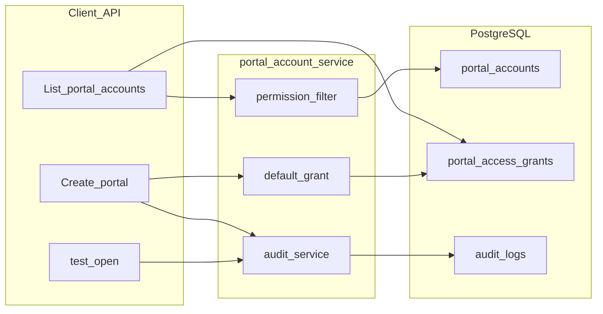

# v7.1 SRM Portal Account 后端实施计划

## 前端表现变化

本次改动无前端表现变化（仅 `nodeskclaw-task` 后端 API 合同稳定化；仓库内尚无 Portal Account 前端页面）。

联调后 Electron/前端将能：
- 分页拉取当前用户可见的客户 SRM 门户列表
- 创建/编辑/删除门户并收到规范错误码（409 重复、403 无权限）
- 「快速打开」拿到 `portalUrl`、`clientOpenMode`、`clientSessionPartition` 等打开上下文

---

## 现状与差距

已有 CRUD 骨架（[`portal_accounts.py`](nodeskclaw-task/app/api/portal_accounts.py)、[`portal_account_service.py`](nodeskclaw-task/app/services/portal_account_service.py)）、租户隔离、DB 唯一索引、部分端点权限校验。对照 [`docs_task/v7.1_srm-portal-account.md`](docs_task/v7.1_srm-portal-account.md) 主要缺口：

| 能力 | 现状 | 目标 |
|------|------|------|
| 列表 | 全量数组、无过滤 | 分页 `{ items, total, page, pageSize }` + 过滤 + PORTAL_VIEW 过滤 |
| 创建 | 无权限、无默认 grant、partition 空 | admin/operator 可创建 + 默认 grant + 自动生成 partition |
| test-open | `canOpen`，缺字段，不校验 ENABLED | PRD 打开上下文 + `allowed` + ENABLED 校验 + 审计 |
| 审计 | 仅模型 | 6 类 `portal_account.*` action 写入 |
| 校验 | 字符串无约束 | URL/枚举/非空 + update 唯一性 |
| Seed | 1 条 Portal、0 条 Grant | ≥3 CUSTOMER + 测试用户 Grant |



---

## 实施步骤

### 1. Schema 与校验（P0）

修改 [`app/schemas/portal_account.py`](nodeskclaw-task/app/schemas/portal_account.py)：

- 新增 `PortalListPageResponse`（对齐 [`TaskListPageResponse`](nodeskclaw-task/app/schemas/task.py)：`items` / `total` / `page` / `pageSize`）
- `PortalTestOpenResponse` 按 PRD 调整：
  - 新增 `portalName`、`status`
  - `canOpen` 改为 `allowed`（`serialization_alias="allowed"`）
- `PortalAccountCreate` / `Update` 增加校验：
  - `portal_url`：必须 `http://` 或 `https://`
  - `entity_type` → `EntityType`（CUSTOMER/SUPPLIER）
  - `status` → `PortalAccountStatus`
  - `client_open_mode` → `ClientOpenMode`
  - 必填字段非空（`erp_entity_code`、`erp_entity_name`、`portal_name`、`login_account`）
- `PortalAccountResponse` 与 PRD 合同对齐：保留 PRD 列出的 14 个字段；`credentialRef` / `rpaProfileId` / `ownerDeptId` 可从对外响应移除（内部列仍保留于 ORM）

### 2. 审计服务（P0）

新建 [`app/services/audit_service.py`](nodeskclaw-task/app/services/audit_service.py)：

```python
async def write_audit_log(
    db, *, tenant_id, actor_id, action, resource_type, resource_id, details=None
) -> None
```

Action 常量（字符串）：
- `portal_account.created` / `updated` / `disabled` / `deleted` / `opened` / `access_granted`
- `resource_type = "portal_account"`

在 service 层各写操作后调用（同事务内 `db.add`，与主记录一起 commit）。

### 3. 权限增强（P1）

扩展 [`app/core/security.py`](nodeskclaw-task/app/core/security.py)：

- 新增 `require_portal_manage_access(user)`：`is_super_admin` 或 `org_role in ("admin", "operator")`；否则 `403` + `errors.autotask.permission_denied`
- 创建端点 [`create_portal_account`](nodeskclaw-task/app/api/portal_accounts.py) 调用此依赖

扩展 [`app/services/permission_service.py`](nodeskclaw-task/app/services/permission_service.py)：

- 新增 `list_accessible_portal_ids(db, user, tenant_id, permission)`：super_admin 返回 `None`（表示不过滤）；普通用户通过 `PortalAccessGrant` JOIN 匹配 USER/ROLE/DEPARTMENT，解析 JSON `permissions` 含目标权限码

同步更新 [`app/services/mcp_service.py`](nodeskclaw-task/app/services/mcp_service.py) 中 `autotask.portal.search`，复用带权限的列表逻辑，避免 MCP 绕过 PORTAL_VIEW。

### 4. Portal Service 核心改造（P0–P2）

改造 [`app/services/portal_account_service.py`](nodeskclaw-task/app/services/portal_account_service.py)：

**列表 `list_portal_accounts`**
- 参数：`entity_type?`, `status?`, `keyword?`, `page=1`, `page_size=20`, `user`
- WHERE：`tenant_id` + `not_deleted`
- 可选过滤：`entity_type`、`status`
- `keyword`：ILIKE 匹配 `erp_entity_name`、`portal_name`、`login_account`、`portal_url`
- 权限：非 super_admin 时 `id IN accessible_ids`
- 返回 `PortalListPageResponse`（count 查询 + offset/limit）

**创建 `create_portal_account`**
- 应用层唯一性校验（已有），`message_key` 改为 `errors.autotask.portal_account.duplicate`
- 若 `client_session_partition` 为空：设为 `persist:portal-{account.id}`（`id` 在 `PortalAccount()` 时已生成 UUID）
- 同事务：写入默认 `PortalAccessGrant`（`subject_type=USER`, `subject_id=createdBy`），权限集：
  `PORTAL_VIEW`, `PORTAL_EDIT`, `PORTAL_OPEN_WEB`, `PORTAL_MANAGE_PERMISSION`, `PORTAL_BIND_WORKFLOW`, `PORTAL_VIEW_TASKS`
- 写 `portal_account.created` 审计

**更新 `update_portal_account`**
- 若变更 `portal_url` / `login_account` / `entity_type`：重新做唯一性校验
- `status` 从非 DISABLED → DISABLED：额外写 `portal_account.disabled`
- 写 `portal_account.updated` 审计（details 记录变更字段）

**删除 `delete_portal_account`**
- 软删除账号；关联 `PortalAccessGrant` 同步 `soft_delete()`（避免孤儿 grant）
- 写 `portal_account.deleted` 审计

**test-open**（逻辑放在 service，API 层薄封装）
- 校验 `status == ENABLED`，否则 `BadRequestError` + `errors.autotask.portal_account.disabled`
- 写 `portal_account.opened` 审计
- 返回完整打开上下文（不含密码/credentialRef）

**create_access_grant**
- 写 `portal_account.access_granted` 审计

抽取内部函数 `_check_portal_uniqueness(db, tenant_id, entity_type, portal_url, login_account, exclude_id?)` 供 create/update 复用。

### 5. API 层调整（P0）

修改 [`app/api/portal_accounts.py`](nodeskclaw-task/app/api/portal_accounts.py)：

- `GET /portal-accounts`：增加 Query 参数 `entityType`, `status`, `keyword`, `page`, `pageSize`；`response_model=ApiResponse[PortalListPageResponse]`
- `POST /portal-accounts`：加 `require_portal_manage_access`
- `POST /{id}/test-open`：改调 service `test_open_portal_account`，返回新 schema

### 6. 异常处理补强（P2）

在 [`app/core/exceptions.py`](nodeskclaw-task/app/core/exceptions.py) 注册 `IntegrityError` handler：唯一索引冲突时映射为 `409` + `errors.autotask.portal_account.duplicate`（兜底 create/update 竞态）。

### 7. Seed 与联调（P3）

- 扩展 [`app/data/seed/srm-portals.json`](nodeskclaw-task/app/data/seed/srm-portals.json) 至 3 条 CUSTOMER（`portal-001`~`003`，不同 erpEntityCode/portalUrl/loginAccount）
- 新增 [`app/data/seed/portal-access-grants.json`](nodeskclaw-task/app/data/seed/portal-access-grants.json)：为 `seed-user-001` 授予 3 个 Portal 的全套权限
- 更新 [`app/startup/seed.py`](nodeskclaw-task/app/startup/seed.py) 加载 grants（在 portals 之后）
- [`.env.example`](nodeskclaw-task/.env.example) CORS 补充 Electron 常见 dev origin（如 `http://127.0.0.1:3000`），注释说明按需配置

**注意**：Seed 幂等逻辑是「tenant 下已有 Portal 则跳过整批」——已导入旧 seed 的本地库需清库重导或手动补 grant。

### 8. 文档与测试

- 更新 [`docs/backend/nodeskclaw_task.md`](docs/backend/nodeskclaw_task.md)：Portal 列表 query/分页响应、test-open 新字段、创建权限说明、审计 action 列表
- 新增 [`tests/test_portal_accounts.py`](nodeskclaw-task/tests/test_portal_accounts.py)，覆盖 PRD 验收 11 条中的核心路径：
  - 分页列表结构
  - 创建 CUSTOMER + 默认 grant
  - 重复创建 409 + message_key
  - PATCH/DELETE 无 PORTAL_EDIT → 403
  - test-open 无 PORTAL_OPEN_WEB → 403；DISABLED → 400
  - test-open 返回 `allowed`/`portalName`/`clientSessionPartition`
  - 响应 `data` 内 camelCase

测试策略：使用现有 pytest + 内存/测试 DB fixture（参考项目惯例）；权限用 seed grant + mock user cache。

---

## 不在本次范围

- Worker API JWT 加固
- RPA Flow 绑定 UI 专用接口
- 明文密码存储 / 自动登录 / 验证码
- 前端 Portal 管理页面（仓库内暂无）
- `ApiResponse` 顶层 `error_code`/`message_key` 改 camelCase（与全项目一致，非本 PRD 专项）

---

## 验收对照（PRD §10）

| # | 验收项 | 实现要点 |
|---|--------|----------|
| 1 | 列表返回当前租户可见 Portal | tenant 过滤 + PORTAL_VIEW grant 过滤 |
| 2 | 创建 CUSTOMER Portal | schema 校验 + admin/operator 权限 |
| 3 | PATCH 更新 | PORTAL_EDIT + 唯一性 |
| 4 | DELETE 软删除 | soft_delete + grant 级联 |
| 5 | test-open 返回打开上下文 | 新 PortalTestOpenResponse |
| 6 | 无 PORTAL_OPEN_WEB → 403 | require_permission 已有 |
| 7 | 无 PORTAL_EDIT → 403 | 已有 |
| 8 | 重复 → 409 | 应用层 + IntegrityError 兜底 |
| 9–10 | ApiResponse + camelCase data | 保持现有包装 |
| 11 | OpenAPI 与实返一致 | schema Field description + 文档 |
