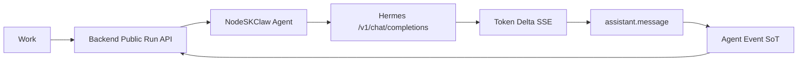
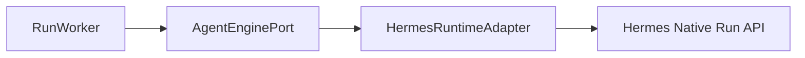
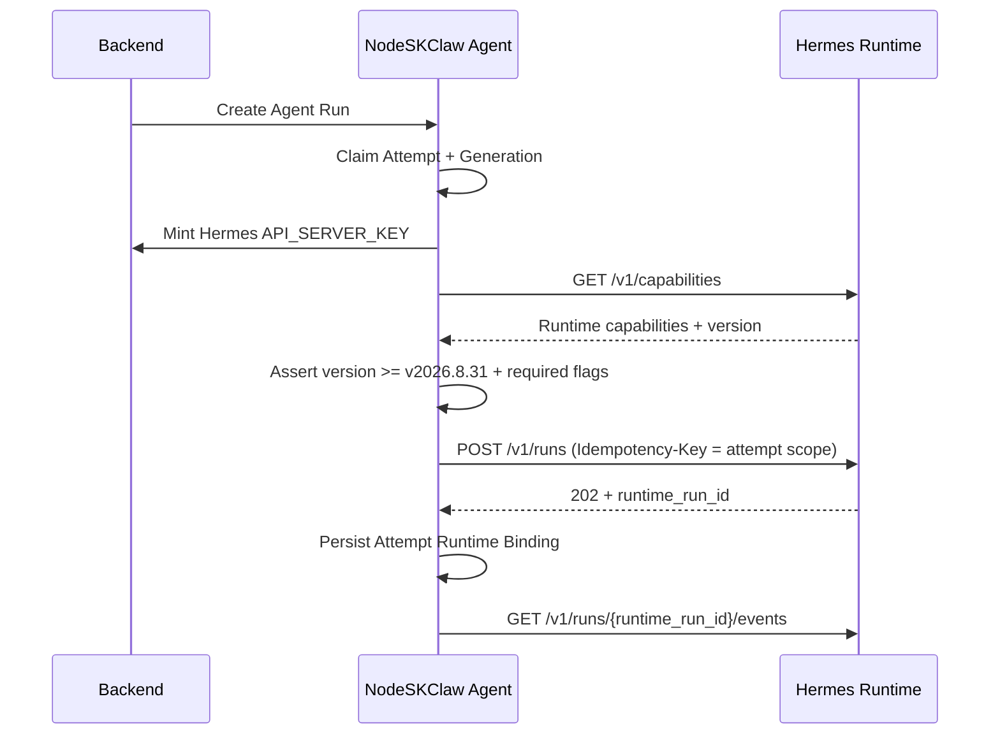
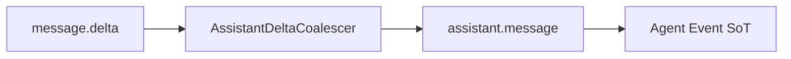
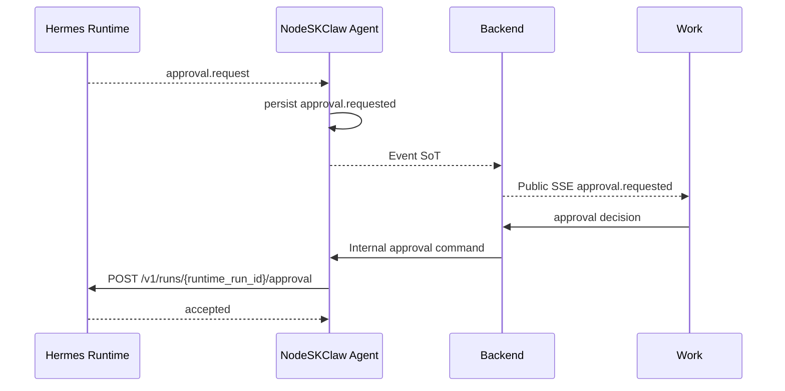

# Architecture Addendum: Skill Agent v1.6 Hermes Runtime Native Run Integration

## 0. Document Status And Scope

本文是 `AD-SKILL-AGENT-V16` 的**架构增补（Addendum）**，不是 AD 全文替换。

父 AD `1.5.0` 的以下章节继续完整有效，本文不改写其字节：Decision Drivers、Evidence Baseline、Options Considered、Ownership & Boundaries、Risks & Kill Criteria、Rejected Alternatives、Roadmap Boundaries（RM-01 至 RM-12）。

本文纠正两个已由真实运行暴露的实现偏差。

**偏差一 — 南向执行协议（第 1 至 30 节）**

> `nodeskclaw-agent` 不得再把 Hermes 当成 OpenAI Model Provider，通过 `/v1/chat/completions` 的 token SSE 模拟 Agent Run Event。
> Hermes 在 Skill Agent v1.6 中是 **Agent Runtime**，正式南向协议必须以 Hermes Native Run API 为主：`/v1/runs + /events + /approval + /stop`。

来源：`nodeskclaw-agent` 生产路径源码审计。

**偏差二 — 员工公共面与执行平面（第 30 节）**

> 员工公共面的契约信封不得因调用者凭证类型而分裂；Catalog 宣告必须等于实际可达能力；HermesTask 平面降级为纯内部投影，执行平面收敛为单一平面；Conformance Gate 必须覆盖 `user_jwt` 员工路径。

来源：`apps/work` 员工端 live 验证报告 + 源码定位。第 30 节同时记录该报告中经核对**不成立**的两项（第 30.5 节）。

两个偏差共享同一根因模式：**证明路径与生产路径不重合**。偏差一表现为 mock OpenAI 字段可通过而真实 Runtime 不可通过；偏差二表现为 CI fixture 可通过而真实员工认证路径不可通过。

父 AD 通过新增引用章节指向本文。本文冻结的内容作为 RM-13 至 RM-16 的 Architecture Source；第 30 节额外重定义 RM-12 的出口信号（第 27 节）。

### 0.1 前端表现变化

本次改动为纯后端 / 执行面架构纠偏，**无前端表现变化**。

Public `SKILL-RUN-CONTRACT v1.2.1` 字节不变，Work 端事件类型集合不变。员工端唯一可感知的差异是既有 Skill Run 的执行质量改善（同一段回复不再被切成上百条 `assistant.message`、工具调用可见、审批与取消真正生效），不涉及任何页面、元素、交互的增删改。

---

# 1. Runtime Version Floor（本次新增冻结）

## 1.1 版本地板

Skill Agent v1.6 的 Hermes 南向执行面冻结 **最低运行时版本 `v2026.8.31`**。

低于该版本的 Hermes Runtime **不得进入生产 Skill Run 路径**，Capability Probe 阶段必须 fail-closed。

依据（逐 tag 读取 `NousResearch/hermes-agent` 源码确认）：

| Runtime 能力 | v2026.4.23 | v2026.8.3 | v2026.8.31 |
|---|---|---|---|
| `GET /v1/capabilities` | 无 | 有 | 有 |
| `POST /v1/runs` | 有 | 有 | 有 |
| `GET /v1/runs/{id}` | **无** | 有 | 有 |
| `GET /v1/runs/{id}/events` | 有 | 有 | 有 |
| `POST /v1/runs/{id}/approval` | **无** | 有 | 有 |
| `POST /v1/runs/{id}/stop` | **无** | 有 | 有 |
| `POST /v1/runs/{id}/steer` | **无** | **无** | 有 |
| `Idempotency-Key` 请求头 | 无 | 无 | **有** |
| Durable run status store | 无 | 无 | **有** |
| 重启后 `interrupted` 终态裁决 | 无 | 无 | **有** |
| Run 归属校验 / 权限分级 | 无 | 无 | **有** |
| `approval.request` 事件 | **无** | 有 | 有 |
| `subagent.start/complete` 事件 | **无**（显式不转发） | 有 | 有 |

`v2026.4.23` 只有 `POST /v1/runs` 与 `GET /v1/runs/{id}/events` 两个 native 入口，无状态查询、无审批、无取消、无能力探测，因此在本架构下不可用于生产。

选择 `v2026.8.31` 而不是 `v2026.8.3` 作为地板，是因为只有 `v2026.8.31` 同时具备 **durable run status**、**重启终态裁决**、**`Idempotency-Key`** 三项，而这三项是第 18 节 Recovery 契约的前置条件。`v2026.8.3` 缺少它们，Recovery 只能退化为内存态尽力而为。

## 1.2 仓内版本引用漂移（必须修复）

当前仓库内所有 Hermes 版本引用仍指向 `v2026.4.23`，与实际运行时（`v2026.8.3` / `v2026.8.31`，由仓外手工脚本绑定）不一致：

| 位置 | 现值 | 处置 |
|---|---|---|
| `nodeskclaw-artifacts/hermes-image/Dockerfile` L3 | `ARG HERMES_VERSION=v2026.4.23` | 注解并抬升至 `v2026.8.31` |
| `nodeskclaw-backend/app/startup/seed.py` L46-47 | `version = "2026.4.23-20260514"`、`image_tag = "v2026.4.23-20260514"` | 注解并抬升 |
| `nodeskclaw-backend/app/startup/seed.py` L51 | 说明文案 `"Hermes 官方 v2026.4.23 基线，NoDeskClaw 于 2026-05-14 打包；"` | 同步改写，避免文案与实际 Runtime 不符 |
| `nodeskclaw-backend/tests/test_registry_seed_defaults.py` L132-133 | 断言 `version` 与 `image_tag` 两个值 | 同步更新断言 |

行号基于 grounded commit `685fced3...`，仅供定位；RM-13 执行时以全仓搜索 `2026.4.23` 的实际命中为准。

该漂移不是文档问题：按当前 Dockerfile 构建出的实例在本架构下会在 Capability Probe 阶段直接失败关闭。修复归属 RM-13。

## 1.3 版本异构约束

在统一到 `v2026.8.31` 完成之前，同一组织内可能并存多个 Runtime 版本。

因此 Capability Snapshot 必须 **per-Attempt 绑定**，禁止按 org、按 Skill 或全局缓存能力判定结果。

---

# 2. Architecture Correction Summary

## 2.1 Current Incorrect Integration

当前 HEAD `685fced3b2b843ea26c69d9c26e8934c9039c116` 中，`nodeskclaw-agent/app/services/hermes_engine.py#execute_hermes_run` 仍执行：

```text
POST {gateway_url}/v1/chat/completions
stream=true
```

并将每一个 `choices[].delta.content` 立即映射为一条 durable `assistant.message`，再由 `RunWorker` 持久化到 Agent `run_events`。

当前链路：



这会产生三个架构错误：

1. **协议层级错误**：把 Agent Runtime 降级成 OpenAI Model Provider。
2. **事件语义错误**：把 Transport Delta 当成 Durable Semantic Event。
3. **Runtime 生命周期丢失**：Hermes 的 Tool、Approval、Run、Stop、Delegation 等结构化运行事实没有成为 Agent 的南向执行输入。

同时暴露三个可直接观察的实现缺陷：

- Agent 发 `run.progress` 的 `payload.stage`，Backend 投影读 `payload.get("phase")`，字段名不一致导致公共面永远取不到 Agent 的进度语义，只能落到 `data.get("status")` 兜底。
- `cancel_event` 置位后仅 `return`，不向 Hermes 发送任何停止信号，Runtime 侧继续消耗资源。
- 失败路径直接把 `str(exc)[:500]` 当作产品语义错误文本，无稳定错误分类。

## 2.2 Correct Target Integration

```mermaid
flowchart LR
    W[Work]
    B[Backend]
    A[NodeSKClaw Agent]
    RA[Hermes Runtime Adapter]
    HR[Hermes Native Run API]

    W -->|Public SKILL-RUN-CONTRACT| B
    B -->|Internal Run Command| A
    A --> RA
    RA -->|POST /v1/runs| HR
    HR -->|runtime_run_id| RA
    RA -->|GET /v1/runs/{id}/events| HR
    RA -->|Normalized Runtime Events| A
    A -->|Durable Event SoT| B
    B -->|SSE Projection| W
```

核心语义：

```text
NodeSKClaw Run
  └── Attempt
        └── Hermes runtime_run_id
```

NodeSKClaw 仍然是 Run / Attempt / Event / Artifact / Terminal 的唯一 Production Owner。Hermes 只拥有自身 Runtime 内部执行事实和 Runtime Delegation。

---

# 3. Preserved Architecture Invariants

以下父 AD 不变量保持不变，本文不重述其完整论证。

## 3.1 Public / Backend Boundary

- Work 只访问 Backend；永不直连 `nodeskclaw-agent`；永不直连 Hermes Runtime。
- Backend 负责 Authentication、Organization isolation、Catalog、Public Run API、Public SSE Projection、Business audit。
- Backend 不成为第二 Event Store 或第二 Run Terminal Owner。

## 3.2 Agent Production Ownership

`nodeskclaw-agent` 继续唯一拥有 Run、Attempt、Generation / Fencing、Step、Event SoT、Artifact、Terminal Aggregation、Central / Edge / Hybrid execution coordination。

Hermes 返回的 `run.completed` 只意味着「当前 Hermes Runtime Step 已完成」，不得直接等价于「NodeSKClaw Run 已完成」。NodeSKClaw 必须继续通过既有 Step State 与 `aggregate_run_terminal()` 裁决最终状态。

## 3.3 Public Contract Freeze

Work canonical contract 继续为 `SKILL-RUN-CONTRACT v1.2.1`（tag `skill-run-contract-v1.2.1`）。本架构纠偏不得修改已发布 v1.2.1 字节。

已有 Public Semantic Event（`assistant.message`、`reasoning.summary`、`tool.call`、`clarify.requested`、`approval.requested`、`artifact.persisted`）足以承载本次南向纠偏。新增 Public Runtime / Delegation Event 必须走新的 Public Contract 版本。

## 3.4 Runtime Delegation Boundary

Hermes Runtime 内部可以执行自身 delegation，但 v1.6 仍然不建设 Platform Multi-Agent Orchestrator、Public Child Run DAG、Team Run、Agent-to-Agent Message Bus、Backend-managed Hermes internal members。

Hermes 的 `subagent.start` / `subagent.complete` 属于 Runtime Internal Trace，默认不得成为 Work Public Event。Central / Edge / Hybrid Placement 与 Hermes Delegation Topology 仍然是两个正交维度。

---

# 4. Hermes Runtime Capability Boundary

## 4.1 Capability Surface（按 v2026.8.31 冻结）

正式 Hermes Adapter 必须按 Runtime Capability 使用以下入口，而不是依赖 Hermes 私有 Python 内部对象：

```text
GET  /v1/capabilities
POST /v1/runs
GET  /v1/runs/{run_id}
GET  /v1/runs/{run_id}/events
POST /v1/runs/{run_id}/approval
POST /v1/runs/{run_id}/stop
POST /v1/runs/{run_id}/steer      # capability-gated，见第 15 节
```

## 4.2 Mandatory Production Capabilities

生产 Skill Run 要求 `GET /v1/capabilities` 返回的 `features` 中以下标志为真。标志名与 Hermes 源码逐字一致，不得使用平台自造别名：

```text
run_submission
run_status
run_events_sse
run_stop
run_approval_response
```

当 Skill / policy 需要审批时，`run_approval_response` 与 `approval_events` 同时为必需。

`run_steer` 为可选能力，缺失不阻断生产 Run。

## 4.3 Capability Probe

正式执行前必须读取 `GET /v1/capabilities`，并将经过验证的 Runtime Capability Snapshot 绑定到当前 Attempt（见第 1.3 节）。

禁止仅以「gateway 可 TCP/HTTP 连接」作为 Runtime Ready。目标判断必须是：

```text
Reachable
AND Authenticated
AND Runtime version >= v2026.8.31
AND Required Runtime Capabilities Available
```

否则 fail-closed。

## 4.4 No Silent Fallback

生产 Skill Run 禁止出现「`/v1/runs` 不可用 → 自动退回 `/v1/chat/completions`」，因为这会使同一个 Skill 在不同 Runtime 状态下产生不同执行语义。

如果需要保留 `/v1/chat/completions` 兼容模式，只能明确标记为 legacy / compatibility mode，不得作为 production Skill Run 默认路径，不得声称满足 Hermes Runtime Provider Conformance。

---

# 5. Hermes Runtime Adapter

将当前 `hermes_engine.py` 从「OpenAI Completion Parser」重构为正式 Runtime Adapter。

概念接口：

```python
class HermesRuntimeAdapter:
    async def probe_capabilities(...)
    async def start_run(...)
    async def stream_events(...)
    async def get_run_status(...)
    async def approve(...)
    async def stop(...)
    async def steer(...)  # optional capability
```

`RunWorker` 不解析 Hermes wire format。所有 Hermes HTTP / SSE 私有格式必须封装在 Runtime Adapter 内。



## 5.1 Run Submission Payload

Hermes `POST /v1/runs` 的请求体与 `/v1/chat/completions` **不同构**，不接受 `messages`。冻结字段来源：

```text
input                   # string 或 message 数组（必填）
instructions            # 可选，等价于 ephemeral system prompt
conversation_history    # 可选，显式历史，优先级高于 previous_response_id
session_id              # 可选，见第 16 节
previous_response_id    # 可选
model                   # 可选，Runtime 侧解析 route
```

请求头：

```text
Authorization: Bearer <runtime API_SERVER_KEY>
Idempotency-Key: <attempt-scoped key>      # 见第 18.3 节
X-Hermes-Session-Key: <memory scope>       # 可选
```

因此 Adapter 的 payload builder 必须整体重写，不是替换 URL。

---

# 6. Runtime Binding Model

## 6.1 runtime_run_id Belongs To Attempt

必须建立：

```text
NodeSKClaw Attempt
    ↔
Hermes runtime_run_id
```

`runtime_run_id` 不得作为 `runs` 的稳定属性。原因：

```text
NodeSKClaw Run
  Attempt 1 → Hermes Run A
  Attempt 2 → Hermes Run B
```

发生 lease timeout、worker crash、retry、takeover 时，新 Attempt 必须能够创建新的 Hermes Run，旧 Hermes Run 的迟到事件不得进入新 Attempt。

Runtime Binding 至少必须具备：

```text
run_id
attempt_id
generation
runtime_type = hermes
runtime_version
runtime_run_id
runtime_session_id?
runtime_profile?
runtime_capability_snapshot
runtime_idempotency_key
created_at
terminal_at?
```

具体保存于 `run_attempts` 扩展字段或独立 Runtime Binding 表，由 Stage PRD / Plan 决定；架构只冻结：

> Binding 必须受 Attempt + Generation Fencing 约束。

---

# 7. Southbound Run Lifecycle

## 7.1 Start



`runtime_run_id` 必须在开始消费 Runtime Event 前完成持久化。

Runtime 侧对未订阅的 run 有 `_RUN_STREAM_TTL` 回收（见第 18.2 节），因此 `POST /v1/runs` 与 `/events` 订阅之间不得插入长耗时操作。

## 7.2 Event Consumption

```text
Runtime Wire Event
   ↓
HermesRuntimeEventNormalizer
   ↓
Transient Event / Durable Semantic Event / Internal Trace
   ↓
Agent RunService
```

不得：

```text
Hermes Wire Event
   ↓
直接 INSERT run_events
```

## 7.3 Terminal

Hermes Runtime 的七个状态值（`v2026.8.31`）：

```text
running
waiting_for_approval
stopping
completed
failed
cancelled
interrupted
```

其中后四个为 Runtime terminal。先更新 Hermes-owned Step：

```text
completed              → SUCCEEDED
failed                 → FAILED
cancelled              → CANCELLED
interrupted            → FAILED（见第 18.1 节）
```

再由 `aggregate_run_terminal()` 判断 NodeSKClaw Run 终态。

---

# 8. Event Model Correction

## 8.1 Three Event Layers

v1.6 必须显式区分三层。

### Layer A — Runtime Transport Event

来源 Hermes Runtime（`v2026.8.31` 实际集合）：

```text
message.delta
tool.started
tool.completed
reasoning.available
approval.request
approval.responded
subagent.start
subagent.complete
run.completed
run.failed
run.cancelled
run.steered
```

这不是 Public Contract。

### Layer B — Agent Durable Event

Agent Event SoT 中只保存稳定控制事实、稳定语义事实、必须可重放的业务事件：

```text
assistant.message
tool.call
approval.requested
run.*
artifact.persisted
```

### Layer C — Public Event

Backend 从 Agent Event SoT 中按冻结合同安全投影。

```text
Runtime Transport
      ↓
Normalizer
      ↓
Agent Durable Event SoT
      ↓
Backend Public Projection
      ↓
Work
```

---

# 9. Hermes → NodeSKClaw Event Mapping

按 `v2026.8.31` 源码确认的 Run Event 处理规则：

| Hermes Runtime Event | Agent Handling | Public v1.2.1 |
|---|---|---|
| `message.delta` | Transient Buffer → Coalesced `assistant.message` | Yes |
| `tool.started` | `tool.call(status=started)`，`call_id` 按第 11 节合成 | Yes |
| `tool.completed` | `tool.call(status=completed/failed)` | Yes |
| `reasoning.available` | **不映射**（见第 12 节） | **No** |
| `approval.request` | `approval.requested`（四档降为两档，见第 13 节） | Yes |
| `approval.responded` | Internal Trace + Approval 状态推进 | No |
| `run.completed` | Step success → Agent terminal aggregator | Control |
| `run.failed` / `run.cancelled` / `run.interrupted` | Step failure/cancel → Agent terminal aggregator | Control |
| `run.steered` | Internal Runtime Trace | No |
| `subagent.start` | Internal Runtime Trace | No |
| `subagent.complete` | Internal Runtime Trace | No |

## 9.1 clarify.requested

Hermes Runtime（`v2026.4.23` / `v2026.8.3` / `v2026.8.31` 三版均已核对）**不提供任何 structured clarification event**。

因此 v1.6 在 Hermes 路径上不产出 `clarify.requested`。该 Public 事件类型保留在冻结合同中，由 Connector 或未来 Runtime 能力承载。

禁止从 assistant text 中推断。

## 9.2 subagent 事件的敏感字段

`subagent.start` / `subagent.complete` 携带 `goal`、`task_count`、`task_index`、`subagent_id`、`child_session_id`、`parent_id`、`depth`、`model`、`tool_count`、`status`、`summary`、`duration_seconds`、token 计数、`api_calls`、`cost_usd`、`files_read`、`files_written`、`output_tail`。

Runtime 侧已对 `preview` / `goal` / `summary` / `output_tail` 施加 `redact_sensitive_text(force=True)`，但 `cost_usd`、`files_*`、`child_session_id` 属于内部执行事实。

这些字段一律只进 Internal Trace，不进 Agent Durable Event，不进 Public 投影。

## 9.3 artifact.persisted

仍由 NodeSKClaw StoragePort 在 Artifact 真正进入 `PERSISTED` 后生成，不由 Hermes message / tool text 推断。

---

# 10. Assistant Delta Coalescing

## 10.1 Architecture Rule

`message.delta` 是 Transport Delta，不得直接等于一条 durable `assistant.message`。必须加入 `AssistantDeltaCoalescer`。



## 10.2 Flush Boundaries

Coalescer 至少在以下条件 flush：

- 达到配置的最大 buffered characters；
- 达到配置的最大 latency；
- 出现段落或明确文本边界；
- 即将产生 `tool.call`；
- 即将进入 approval；
- Runtime terminal；
- Adapter shutdown / controlled cancellation。

具体字符数和时间阈值留给 Stage PRD / implementation tuning。架构只冻结：

> 一个 provider token 不得自动等价于一条 durable Event。

## 10.3 Ordering

当出现：

```text
message.delta
message.delta
tool.started
```

必须保证：

```text
assistant.message(flush)
tool.call(started)
```

顺序进入 Agent `event_seq`。因此 semantic boundary 会强制 flush assistant buffer。

---

# 11. Tool Event Semantics

## 11.1 Target Event

```json
{
  "event_type": "tool.call",
  "payload": {
    "tool_name": "...",
    "call_id": "...",
    "status": "started|completed|failed"
  }
}
```

冻结合同 `v1.2.1` 的 `ToolCallPayload.call_id` 为 **required**。

## 11.2 Upstream Gap

Hermes 的 `tool.started` / `tool.completed` 事件**不携带调用标识**：

```text
tool.started   → { event, run_id, timestamp, tool, preview }
tool.completed → { event, run_id, timestamp, tool, duration, error }
```

但上游 `tool_call_id` **本身是存在的**，只是 `tool_progress_callback` 在这两个调用点未透传：同一个 callback 在 `tool.output_risk` 事件上就以 `tool_call_id=` kwarg 传出，`tool_complete_callback` 也带该参数。API Server 侧的 `_make_run_event_callback` 已用 `**kwargs` 接收，透传后即可带出。

## 11.3 Dual-Track Correlation（本次冻结）

**近期路径（Adapter 合成）**

Adapter 在当前 Attempt 内合成稳定 `call_id`，并标注关联置信度：

```text
call_id = f"{attempt_id}:{tool_name}:{segment_seq}"
correlation_confidence = high | low
```

置信度判定必须考虑 Hermes 的并行执行事实：Hermes 按 `_plan_tool_batch_segments` 将一批工具调用切成 contiguous 的 parallel / sequential 段，parallel 段在线程池并发执行。因此：

- sequential 段内的同名工具 → FIFO 配对安全 → `high`
- parallel 段内出现同名工具并发 → FIFO 配对可能错配 → `low`

`correlation_confidence` 只进 Internal Trace 与 Observability，不进 Public 投影。

**目标路径（上游透传）**

以「上游 `tool.started` / `tool.completed` 透传 `tool_call_id`」为目标，作为独立跟踪项推进上游 PR。Capability Probe 探测到上游支持后，Adapter 切换为直接使用 upstream `tool_call_id`，并将 `correlation_confidence` 固定为 `high`。

## 11.4 Pairing Is Not Guaranteed

`tool.started` 无条件发出，而 `tool.completed` 仅在工具未被 guardrail 阻断时发出。因此 Adapter 不得假设二者必然成对，必须具备收尾策略：Runtime terminal 时将仍处于 `started` 的 `call_id` 按当前 Runtime 终态收敛，并记录 observability gap。

## 11.5 Forbidden Fields

禁止公开 raw tool arguments、Authorization header、connector credential、browser ticket、raw command secret、storage path。

Hermes `tool.completed` 只提供 `error` boolean，映射为：

```text
error=false → completed
error=true  → failed
```

---

# 12. Reasoning Boundary

## 12.1 决议：Hermes 路径不产出 reasoning.summary

Hermes 的 `reasoning.available` **不是安全摘要**。上游实现为：

```python
_think_text = assistant_message.content.strip()
_think_text = re.sub(r'</?(?:REASONING_SCRATCHPAD|think|reasoning)>', '', _think_text).strip()
agent.tool_progress_callback("reasoning.available", "_thinking", _think_text[:500], None)
```

即：剥离 reasoning 标签后取模型原始文本前 500 字符。API Server 侧对该事件**不施加脱敏**（同一函数内 `subagent.*` 的自由文本字段均调用了 `redact_sensitive_text(force=True)`，`reasoning.available` 未调用）。

因此它承载的是 **Raw Chain-of-Thought 截断**，而非 Runtime 定义的可公开安全摘要。

Skill Agent 继续执行 v1.6 安全边界：

```text
Reasoning Summary
≠
Raw Chain-of-Thought
```

**冻结结论**：v1.6 在 Hermes 路径上不映射 `reasoning.available`，不产出 `reasoning.summary`。

`reasoning.summary` 事件类型保留在冻结合同 `v1.2.1` 中，待 Runtime 提供明确定义为安全摘要的数据后，经新的架构修订重新评估。

## 12.2 禁止

- 保存完整 internal reasoning；
- 通过 NL parser 生成 summary；
- 将 Hermes 私有 thinking stream 复制到 Work；
- 以 `reasoning.available` 直接充当 `reasoning.summary`。

---

# 13. Approval Bridge

## 13.1 双向闭环



关键不变量：

- Work 不持有 `runtime_run_id`。
- Backend 不直接调用 Hermes。
- Agent 使用 Attempt Runtime Binding 查找 `runtime_run_id`。
- 旧 Attempt 的 approval command 必须被 fencing 拒绝。
- Hermes approval 成功不直接修改 NodeSKClaw terminal 状态。

## 13.2 四档内部 / 两档公共（本次冻结）

Hermes `POST /v1/runs/{id}/approval` 的 `choice` 支持四档：

```text
once      # 别名 approve / approved / allow
session
always
deny
```

并接受可选 `all` 布尔。错误语义：`404 run_not_found`、`409 approval_not_active`、`400 invalid_approval_choice`。

而冻结合同 `v1.2.1` 的 `ApprovalRequestedPayload` 只有 `approval_id` + `summary`，公共面无法表达 `session` / `always` 两档。

**冻结结论**：

- **Internal Southbound 保留四档**：Agent 内部审批命令与 Runtime Adapter 完整支持 `once` / `session` / `always` / `deny`，作为 Internal Contract 字段（归属 RM-08）。
- **Public 面只暴露两档**：Work 只能表达批准与拒绝，分别映射为 `once` 与 `deny`。
- `session` / `always` 只能由服务端策略（Skill Release / org policy）决定，不接受客户端提交。若未来需要向 Work 开放，必须走新的 Public Contract 版本。

## 13.3 Approval 隔离

Hermes 侧 `approval_session_key = run_id`，即审批队列按 Runtime Run 隔离，多个共享同一 `session_id` 的并发 run 不会互相解锁。Agent 侧的审批命令必须始终携带 `runtime_run_id`，不得用 `session_id` 寻址审批。

---

# 14. Stop / Cancel Bridge

当前 NodeSKClaw cancel 只停止本地 SSE 消费。目标：

```text
Work Cancel
  ↓
Backend
  ↓
Agent CANCELLING
  ↓
Hermes POST /v1/runs/{runtime_run_id}/stop
  ↓
Runtime cancellation outcome
  ↓
Agent Step State
  ↓
aggregate_run_terminal()
```

Agent 必须保持 cooperative cancellation + fencing。

Runtime 侧 stop 语义：置状态为 `stopping`，返回 `{run_id, status: "stopping"}`；**若 run 已结束（agent 与 task 均已清理）返回 `404 run_not_found`**。stop 是协作式的，执行线程可能晚于 HTTP 响应结束。

因此 stop request 的处置：

- Hermes 返回 `404`：视为已 terminal，进入 terminal reconciliation（查 `GET /v1/runs/{id}`），不判为 stop 失败；
- Hermes 返回 `stopping`：等待 `run.cancelled` 或按第 18 节 reconcile；
- Hermes unreachable：记录 `RUNTIME_STOP_FAILED`，由 Agent 既有取消策略裁决；
- 旧 Attempt：禁止向旧 / 新错误 Runtime Run 发 stop。

---

# 15. Runtime Steer

Hermes `v2026.8.31` 提供 `POST /v1/runs/{id}/steer` 与 `run_steer` capability flag（`v2026.8.3` 无）。

Public `SKILL-RUN-CONTRACT v1.2.1` 不要求新增公开 steer 能力。因此：

- Southbound Adapter 可以预留 `steer()`，并按 `run_steer` capability 判定可用性；
- 是否向 Work 暴露属于独立 Public Contract 变化；
- 未批准前不得从私有前端语义倒灌 Backend API；
- `run.steered` 事件只进 Internal Trace。

---

# 16. Session / Context Mapping

RM-06 的 Formal Run Session / Execution Context 不变。NodeSKClaw 的 `run_session_id`、`execution_context`、`context_version` 仍为平台授权事实。

## 16.1 Runtime Session Continuity

Hermes `POST /v1/runs` 接受 `session_id`。当请求未携带 `conversation_history` 且未携带 `previous_response_id` 时，Runtime 会按 `session_id` 自动回灌该 session 的历史；未提供 `session_id` 时退化为 `session_id = run_id`。

因此建立映射：

```text
NodeSKClaw Run Session
      ↔
Hermes runtime_session_id
```

该映射是第 18.1 节 Recovery 规则的实现基础。

## 16.2 禁止

- 让 Hermes session 取代 NodeSKClaw authorization context；
- 从 Hermes session 反向授予 Workspace / Knowledge 权限；
- 把 Runtime private session id 暴露给 Work；
- 用 `session_id` 寻址审批或 stop（必须用 `runtime_run_id`）。

---

# 17. Credential Boundary

HEAD `685fced3...` 已修正 Hermes Runtime Credential Lease：Backend Attempt-time mint 返回 Hermes 实例 `API_SERVER_KEY`；不再使用平台 JWT 冒充 Hermes API Bearer；缺少 Runtime key 时 fail-closed。该方向继续保留。

新 Runtime Adapter 对以下入口统一使用该短期取得的 Runtime Credential：

```text
/v1/capabilities
/v1/runs
/v1/runs/{id}
/v1/runs/{id}/events
/v1/runs/{id}/approval
/v1/runs/{id}/stop
/v1/runs/{id}/steer
```

禁止把 Bearer 写入 ExecutionSnapshot、Run Event、Artifact，或投影给 Backend Public API / Work。

## 17.1 Runtime 侧权限分级

`v2026.8.31` 的 run 端点按操作分级校验（`dispatch` / `status` / `approve` / `stop`），并支持 scoped grant token 与 run 归属校验（`_request_owns_run`）。

架构冻结：Credential Lease **应当**按最小权限签发；同时 Agent 不得依赖 Runtime 侧归属校验作为租户隔离手段——`org_id` 隔离仍由 Backend 与 Agent 负责。

---

# 18. Replay, Recovery And Runtime Durability

这是本次修订必须新增的工程门禁。

## 18.1 Recovery Behaviour（本次冻结）

**Runtime Event Stream 不可重放。** `GET /v1/runs/{id}/events` 背后是进程内 `asyncio.Queue`，SSE handler 在 `finally` 中执行 `self._run_streams.pop(run_id)`，且不支持 `Last-Event-ID` 或重复订阅。断开后重新订阅必然得到 `404 run_not_found`。

因此**禁止**把「恢复消费 Runtime Event Stream」作为恢复路径；Agent Event SoT 才是平台对 Work 的 durable replay source。

**冻结的恢复路径**：

```text
1. 根据 Attempt Runtime Binding 找到 runtime_run_id
2. 查询 GET /v1/runs/{runtime_run_id}
3. 按返回 status 做 terminal reconciliation
4. 记录 observability gap（缺失的 Transport Event 不得伪造）
5. NodeSKClaw Event SoT 已持久化事件不重复写入
```

**Runtime 状态可得性**（`v2026.8.31`）：

- `GET /v1/runs/{id}` 先查内存 `_run_statuses`，未命中则回落到**持久化 run status store**（按 auth scope + `retention_until` 检索）。
- 持久记录携带 `owner_pid` + `owner_started`。若该 run 为非终态且 owner 进程已消失（或 PID 复用但启动时间不符），Runtime 会将状态改写为 `interrupted`，`error` 为 `"The gateway restarted before this run settled."`，`last_event` 为 `run.interrupted`，并持久化。

即：**Hermes 重启不会导致状态丢失，而是产生明确的 `interrupted` 终态。**

**按 status 的裁决规则**：

| Runtime status | Agent 处置 |
|---|---|
| `running` / `waiting_for_approval` | Runtime 仍在执行，Agent 保持 Attempt 存活并继续 reconcile |
| `stopping` | 等待 terminal 或按取消策略裁决 |
| `completed` | Step SUCCEEDED，用 status 的 `output` / `usage` 补齐结果 |
| `failed` | Step FAILED |
| `cancelled` | Step CANCELLED |
| `interrupted` | Step FAILED + `RUNTIME_INTERRUPTED`，进入下述会话重启规则 |
| `404 run_not_found`（超出 retention） | Step FAILED + `RUNTIME_STATE_UNAVAILABLE`，进入下述会话重启规则 |

**会话重启规则**：当 Runtime 返回 `interrupted`，或 durable store 已超出 retention 而查不到状态时，Agent 判定当前 Run 为 **FAILED**。Agent **不得**自动新建 Attempt 续跑。恢复执行必须由用户主动发送新的提示词，Agent 以同一 `runtime_session_id`（见第 16.1 节）创建新的 NodeSKClaw Run，从而复用 Hermes session 历史。

## 18.2 Runtime Retention Constraints（显式架构约束）

以下 Runtime 侧常量是 Recovery 契约的边界，必须作为架构约束记录：

```text
_RUN_STREAM_TTL = 300     # 秒。无活跃订阅者的 run transport 队列回收周期
_RUN_STATUS_TTL = 3600    # 秒。已终态 run 的内存状态记录清理周期
```

语义细节：

- `_RUN_STREAM_TTL` 的清理**跳过**已有活跃订阅者的 run；Runtime 明确「transport 年龄不等于 run 年龄」，live control state 存活至执行任务返回。因此 `POST /v1/runs` 后必须在 300 秒内建立 `/events` 订阅。
- `_RUN_STATUS_TTL` 只清理 `completed` / `failed` / `cancelled` 的**内存**记录；**非终态记录不会被 TTL 清理**，且持久 store 另有自己的 retention。
- 无活跃订阅者时事件不入队（`_put_event_if_active`），因此 terminal 事件可能永远不会出现在 SSE 上。**Status 轮询是唯一可靠的 terminal 来源。**

Agent 不得假定 Hermes `/events` 具有与 Agent Event SoT 相同的永久 replay 能力。

## 18.3 Provider Event Idempotency

**Run 提交幂等**：`POST /v1/runs` 支持 `Idempotency-Key` 请求头（1-255 个可见 ASCII 字符，按 auth scope + 请求体指纹去重）。Agent 必须使用 **Attempt 作用域**的 key，使 retry 不会重复启动 Hermes Run。该 key 进入 Runtime Binding（第 6.1 节）。

**事件幂等**：Hermes Runtime Event **不携带稳定 upstream id 或序号**（`v2026.8.3` / `v2026.8.31` 均已确认无 `event_id`、`event_seq`、`Last-Event-ID`）。

因此不存在「上游提供稳定 id」的分支。Adapter 必须在当前 Attempt 内建立稳定 correlation strategy：

```text
source = hermes-runtime
source_event_id = <adapter-derived, attempt-scoped stable key>
```

具体序列化方案由 Stage PRD 决定，但必须满足：

- 同 Attempt reconnect 不产生可观察重复副作用；
- 旧 Attempt event 不能写入新 Generation；
- tool start / complete 能按第 11.3 节稳定关联同一 call。

---

# 19. Progress Event Normalization

## 19.1 Canonical 内部字段

当前实现存在 `Agent payload.stage` 与 `Backend projection payload.phase` 的不一致，导致公共面取不到 Agent 进度语义。

新架构定义单一 canonical 内部字段 `phase`，Runtime Adapter 只输出受控值：

```text
PREPARING
RUNTIME_STARTING
RUNTIME_RUNNING
WAITING_APPROVAL
STOPPING
RECONCILING
```

不得再让 `stage` / `phase` / `status` 在不同组件中表达相同概念而无 canonical mapping。

## 19.2 双发兼容（本次冻结）

冻结的 `v1.2.1` 合同包内部对该字段自相矛盾，且字节不可改写：

| 冻结 fixture | 字段 |
|---|---|
| `fixtures/run-event-control-progress.json` | `payload.stage = "preparing"`（小写） |
| `fixtures/sse-resume-duplicate.json` | `payload.phase = "RUNNING"`（大写） |

Schema 侧 `RunEventControlV12.payload` 为 `additionalProperties: true`，两者均放行；Postman 消费者集合未断言这两个字段。

**冻结结论**：控制事件 payload **同时发出 `phase` 与 `stage` 两个字段**。

- `phase` 为 canonical，取值为 19.1 的大写枚举；
- `stage` 为兼容字段，取对应小写形式，仅供已按旧 fixture 实现的既有消费者；
- 二者必须由同一 canonical 值派生，禁止各自独立赋值；
- 新消费者一律读 `phase`；`stage` 的移除必须走新的 Public Contract 版本。

---

# 20. Error Model

Hermes Runtime Adapter 必须产生稳定错误分类，而不是把 httpx Exception 文本直接作为产品语义。至少区分：

```text
RUNTIME_UNREACHABLE
RUNTIME_UNAUTHORIZED
RUNTIME_VERSION_UNSUPPORTED
RUNTIME_CAPABILITY_MISSING
RUNTIME_CAPACITY_EXCEEDED
RUNTIME_START_FAILED
RUNTIME_EVENT_STREAM_FAILED
RUNTIME_APPROVAL_FAILED
RUNTIME_STOP_FAILED
RUNTIME_PROTOCOL_INVALID
RUNTIME_INTERRUPTED
RUNTIME_STATE_UNAVAILABLE
```

新增分类的来源：

- `RUNTIME_VERSION_UNSUPPORTED`：Runtime 版本低于第 1.1 节地板。
- `RUNTIME_CAPACITY_EXCEEDED`：超过 `gateway.api_server.max_concurrent_runs` 时 Runtime 返回 `429 rate_limit_exceeded`。
- `RUNTIME_INTERRUPTED`：Runtime 返回 `interrupted`（gateway 重启前未落定）。
- `RUNTIME_STATE_UNAVAILABLE`：Runtime 状态超出 retention，`GET /v1/runs/{id}` 返回 404。

Public 是否暴露这些 code 由 Public Contract 决定。Agent Internal Event / Trace 必须能够区分这些类别。

---

# 21. Observability

RM-10 的执行面 Observability 需要把 Runtime Binding 纳入统一 trace。

建议 correlation：

```text
request_trace_id
run_id
attempt_id
generation
runtime_type
runtime_version
runtime_run_id
runtime_session_id?
runtime_idempotency_key?
tool_call_id?
correlation_confidence?
```

指标至少能够回答：

- Runtime start latency
- Runtime event stream duration
- message delta count
- coalesced assistant event count
- tool start / complete count 与未配对 start 计数
- approval wait duration
- stop latency
- runtime disconnect count
- runtime reconciliation count
- runtime interrupted count
- event coalescing ratio

Metrics / Trace 不得成为第二 Event SoT。

---

# 22. Source Of Truth Matrix

| Domain | Production Owner | Hermes Role |
|---|---|---|
| Employee Auth | Backend | None |
| Org Boundary | Backend | Consume only |
| Catalog | Backend | None |
| Skill Release | Backend | Runtime reference consumer |
| ExecutionSnapshot | Agent | Consume runtime policy |
| Run | Agent | Executes runtime step |
| Attempt / Generation | Agent | Bound to one runtime run |
| Event SoT | Agent | Supplies runtime facts |
| Public SSE | Backend | None |
| Tool execution inside Hermes | Hermes Runtime | Owner |
| Runtime delegation | Hermes Runtime | Owner |
| Runtime run id | Agent Attempt binding + Hermes | Private |
| Runtime run status durability | Hermes Runtime | Owner，受 retention 约束 |
| Runtime capability advertisement | Hermes Runtime | Owner |
| Artifact persistence | Agent StoragePort | May produce content, not persistence truth |
| Terminal Run decision | Agent | Supplies step outcome |
| Workspace / Knowledge authorization | Backend + Agent revalidation | Must not grant |
| Public Contract | Backend Contract Package | Must not redefine |

---

# 23. Forbidden Architectures

## 23.1 Continue Parsing ChatCompletion Tokens

禁止继续以 `/v1/chat/completions` + `choices[].delta.content` 作为正式 Skill Run Event Source。

## 23.2 Parse Natural Language Into Runtime Events

禁止 `assistant text → regex / LLM infer → tool.call / approval / clarify`。

## 23.3 Backend Direct Hermes Integration

禁止 `Backend → Hermes /v1/runs`。生产执行必须经过 Agent。

## 23.4 Runtime Owns Platform Terminal

禁止 `Hermes run.completed → Backend public Run COMPLETED`。必须经过 Agent terminal aggregator。

## 23.5 Runtime Event Store Replaces Agent Event Store

Hermes event stream 不能取代 Agent `run_events`。

## 23.6 Silent Compatibility Fallback

禁止 Native Run API 不可用时无感降级 ChatCompletion。

## 23.7 Resume By Re-subscribing Runtime Stream

禁止把重新订阅 `/events` 当作恢复手段（第 18.1 节）。

## 23.8 Project Raw Reasoning As Summary

禁止把 `reasoning.available` 直接当作 `reasoning.summary` 投影（第 12 节）。

## 23.9 Run Production Skill On Sub-Floor Runtime

禁止在低于 `v2026.8.31` 的 Hermes Runtime 上执行生产 Skill Run（第 1.1 节）。

## 23.10 Credential-Dependent Public Envelope

禁止以调用者凭证类型（`auth_type`）决定公共契约信封形状（第 30.1 节）。

## 23.11 Catalog Advertisement Diverging From Reachable Capability

禁止 Catalog 宣告的能力集与该调用者实际可达能力集不一致（第 30.2 节）。

## 23.12 Public Exposure Of Internal Execution Plane

禁止在任何公共信封、公共 SSE 或公共 REST 响应中出现 HermesTask 平面标识与路由内部字段（第 30.3 节）。

---

# 24. Migration Strategy

## Phase A — Runtime Native Run Bridge

- Runtime 版本地板与仓内版本漂移修复
- Hermes capability probe
- `POST /v1/runs`（含 `Idempotency-Key`）
- Runtime Binding
- `/events` 消费
- terminal reconciliation
- `/stop`
- production path 移除 ChatCompletion

这是首个阻断修复。

## Phase B — Semantic Runtime Event Normalization

- `message.delta` coalescing
- `tool.started/completed` 与 dual-track `call_id`
- approval request 映射
- event source correlation
- progress canonical `phase` + `stage` 双发

## Phase C — Control Closure

- approval response bridge（四档内部 / 两档公共）
- cancel/stop closure
- recovery/reconcile 与会话重启规则
- stale Attempt fencing
- runtime status reconciliation

## Phase D — Provider Conformance

使用真实 Hermes Runtime，而不是 Mock OpenAI response，证明：

```text
Skill invokes Hermes
→ Hermes uses tools
→ Agent receives structured runtime events
→ Agent stores semantic events
→ Backend replays semantic SSE
→ Work renders meaningful execution flow
```

---

# 25. Provider Conformance Gate

后续任何 Roadmap Item 不得再用 mock `choices[].message.tool_calls`、mock reasoning、mock clarification、mock approval 单独证明 Hermes Provider Conformance。

至少必须存在一条真实 Hermes API Server（`>= v2026.8.31`）测试链。

## 25.1 Required Conformance Scenarios

以下七个场景在 `v2026.8.31` 上全部可执行。

### PC-01 Plain Response

Hermes 不调用工具，只返回文本。验证 Public 内容完整；`assistant.message` 数量显著少于 provider token 数；不虚构 tool / approval 事件；不产出 `reasoning.summary`。

### PC-02 Tool Run

Skill 明确触发 Hermes Tool。验证 `tool.started → tool.call(started)`、`tool.completed → tool.call(completed/failed)`，`call_id` 稳定关联，Work SSE 可观察。

### PC-03 Approval

触发真实 Hermes approval。验证 `Hermes approval.request → Agent approval.requested → Work → Backend → Agent → Hermes /approval`，并验证公共面只暴露批准/拒绝两档、内部保留四档。

### PC-04 Cancel

运行中取消。验证 `Work cancel → Agent → Hermes /stop → Agent terminal aggregation`，并覆盖 stop 返回 `404` 时的 terminal reconciliation 分支。

### PC-05 Worker Recovery

Runtime Run 正在执行时重启 / kill NodeSKClaw Worker。验证 old Attempt fencing、通过 `GET /v1/runs/{id}` 完成 runtime status reconciliation、无重复 Public terminal、无旧代副作用、observability gap 已记录。

### PC-06 Long Output

Hermes 输出长中文报告。验证不再产生「一两个汉字一个 run_event」、数据库 Event 数量受 coalescing 控制、最终文本无丢失无重复且顺序正确。

### PC-07 Runtime Delegation

Hermes 内部调用 subagent。验证 NodeSKClaw Run 仍为单一 Public Run、`subagent.start/complete` 不形成 Public Child Run 且敏感字段未外泄、Runtime terminal 仍映射到当前 Attempt / Step。

### PC-08 Runtime Restart Interrupted

Hermes Runtime 在 run 未落定时重启。验证 `GET /v1/runs/{id}` 返回 `interrupted`、Agent 判 FAILED 并给出 `RUNTIME_INTERRUPTED`、不自动新建 Attempt 续跑、用户以新提示词可基于同一 `runtime_session_id` 继续。

### PC-09 Version Floor Fail-Closed

指向低于 `v2026.8.31` 的 Runtime。验证 Capability Probe 阶段失败关闭并返回 `RUNTIME_VERSION_UNSUPPORTED`，不降级到 ChatCompletion。

### PC-10 Employee JWT Envelope Parity

以真实员工 user JWT（`auth_type = user_jwt`）对目标 Skill 发起 `tools/call`。验证返回的 `structuredContent` 为冻结 v1.2.1 形状（`run_id` + `/api/v1/runs/*` + `contract_version`），且不含 HermesTask 平面字段。当前员工公共面只证明用户端路径；`mcp_client_token` 不是现行用户端功能（历史容器互调），不得作为本场景 live 前置，也不得通过更换另一个仅对该 Token 授权的 Skill 来绕过。

### PC-11 Catalog Reachability Parity

对员工 `user_jwt`，比对 `tools/list` 宣告的 `executionModes` / `defaultExecutionMode` 与该调用者实际 `tools/call` 解析出的执行模式。验证两者相等；不等即判本场景失败。

### PC-12 Single Plane Isolation

对公共面全部响应（`tools/call` 信封、`GET /api/v1/runs/{id}`、`/result`、`/artifacts`、`/events` 全量帧）做字段全扫描。验证不出现第 30.3 节禁止字段清单中的任何键或 `/api/v1/hermes/tasks/` 路径片段。

### PC-13 Public Terminal Delivery

覆盖 `COMPLETED` / `FAILED` / `CANCELLED` / `TIMED_OUT` 四种终态。验证公共 SSE 对每一种都投递合同终态事件后关闭，不出现「已达终态但流上无终态事件」的静默关闭，也不出现无终态事件的长挂连接。`TIMED_OUT` 必须映射为合同终态而非通用 delta。

### PC-14 Employee Public Face Regression Corpus

以真实员工路径（user JWT + Work 实际调用序列）复跑 PC-01 至 PC-04 的公共面断言。CI fixture 通过不得替代本场景（第 30.4 节）。

---

# 26. Acceptance Architecture Metrics

## Event Quality

错误状态：

```text
~1-3 characters / assistant.message
hundreds of durable events for a short answer
```

目标：

```text
transport delta count >> durable assistant.message count
```

并确保最终 assistant text 完整。

## Runtime Fidelity

工具调用时同时满足：Hermes 侧有 Tool、Agent Event SoT 有 `tool.call`、Backend Public SSE 有 `tool.call`。

## Control Fidelity

审批与取消：`Work action → Backend → Agent → same Attempt runtime_run_id → Hermes control endpoint`。

## Ownership Fidelity

始终满足 `Hermes terminal ≠ Platform terminal owner`，最终状态仍由 Agent 聚合。

---

# 27. Impact On Existing Roadmap

本架构不撤销 RM-01、RM-03、RM-05、RM-06、RM-11。

本次真实运行证明两项出口信号失效。

## 27.1 RM-02 — Hermes Provider Conformance 证明不足

RM-02 已交付的 Event SoT、`event_seq`、fencing、semantic schema、public contract 仍然可复用，**不回滚 Event Store**。但其 Provider Conformance 出口信号失效，因此 RM-02 状态回退为 `BACKLOG`，由本文第 25 节冻结的 Conformance Gate 重新定义其退出条件。

## 27.2 RM-12 — 员工公共面符合性证明不足

`apps/work` live 报告证明：RM-12 声称收敛的三项漂移（Public Run 仍输出 Portal 信封、SSE 未投影合同已冻结的全部语义事件、幂等未承载冻结合同语义）在真实员工认证路径上仍然成立。父 AD v1.5.0 自身在 Decision Drivers 中已列出这三项漂移，RM-12 即为修复它们而设立。

失效原因与 RM-02 同构：证明路径与生产路径不重合。RM-12 的 CI fixture 覆盖 v1.2.1 构造路径，未覆盖 `user_jwt → queued → HermesTask 信封` 的员工实际路径。

处置：

- RM-12 已交付的 Catalog、prompt-first 绑定、Workspace ACL 边界、跨组织 fail-closed 等成果**保留复用，不回滚**。
- RM-12 的公共面符合性出口信号失效，状态回退为 `BACKLOG`。
- 其退出条件由第 30 节四条不变量与第 25 节 PC-10 至 PC-14 重新定义。
- 第 30.3 节的 HermesTask 平面降级属于 RM-12 重新定义后的范围，不新增 Roadmap Item——该工作本就属于「员工公共面实现符合性」这一原始 Outcome。
- 第 30.5 节列出的两项不成立发现不进入 RM-12 范围。

### 27.2.1 与南向线的并行关系

RM-12 的回退**不阻断** RM-13 至 RM-16。员工公共面（Work ↔ Backend 的信封、Catalog、执行平面）与 Hermes 南向（Agent ↔ Runtime 的协议、事件、控制）是两条正交的线，因此 RM-13 依赖 RM-11 的合同包基线，不依赖 RM-12。

唯一耦合点是第 30.3 节的单一平面收敛与 RM-14 的公共投影改动落在同一段代码。处置方式是协同约束而非串行依赖：两项中先完成者必须复跑对方的公共面断言（PC-12 与 PC-13），禁止各自改一半导致公共面出现混合平面，同时禁止以「等对方先完成」互相阻塞。

## 27.3 RM-10 — 范围补充

RM-10 的 Observability PRD 必须同步纳入第 21 节的 runtime correlation 字段。

此外，第 30.3 节要求投影失败必须可观察，因此 RM-10 需覆盖投影落后 / 投影失败的指标与告警，禁止静默。

需要新增 Roadmap Item 修正的范围：

```text
Hermes Runtime Southbound Protocol
Runtime Binding
Native Runtime Event Bridge
Provider Conformance
```

---

# 28. Roadmap Handoff

本文对应新增四个独立可验收 Roadmap Item。

## RM-13 — Hermes Native Runtime Bridge

Outcome：

> Agent 使用 Hermes `/v1/runs` 建立 Attempt 级 Runtime Run，并完成 Native Event / Terminal / Stop 基础闭环；Runtime 版本地板生效，仓内 `v2026.4.23` 引用漂移修复。

对应 Phase A。这是下一项阻断修复。

## RM-14 — Runtime Semantic Event Fidelity

Outcome：

> Hermes Tool / Assistant Delta 经结构化 Normalizer 与 Coalescer 成为低噪声、可回放的 Agent Event SoT；progress 字段收敛为 canonical `phase` 并双发 `stage` 兼容。

对应 Phase B。

## RM-15 — Approval & Runtime Control Closure

Outcome：

> Public approval / cancel 与 Hermes Runtime approval / stop 形成同 Attempt、可 fencing 的双向闭环；内部保留四档审批语义，公共面只暴露两档；恢复路径按状态查询 reconcile 并落地会话重启规则。

对应 Phase C。

## RM-16 — Hermes Provider Conformance & Recovery

Outcome：

> 真实 Hermes（`>= v2026.8.31`）、真实 Tool、长输出、Worker restart、Runtime restart、版本地板失败关闭全部取得可复现实跑证据（PC-01 至 PC-09）。

对应 Phase D。同时承接 RM-02 重新定义后的 Provider Conformance 出口。

## 独立跟踪项

`tool.started` / `tool.completed` 透传 `tool_call_id` 的上游 PR（第 11.3 节目标路径）不阻塞 RM-13 至 RM-16，作为独立跟踪项推进；上游合并后由 Capability Probe 驱动 Adapter 切换。

---

# 29. Evidence Baseline

## NodeSKClaw

```text
loudon84/nodeskclaw
main
685fced3b2b843ea26c69d9c26e8934c9039c116
```

Relevant facts:

- `docs_agent/architecture/AD-SKILL-AGENT-V16.md`：父 AD 版本 `1.5.0`；Backend / Agent ownership；Public Contract v1.2.1 freeze；Runtime Delegation boundary。
- `nodeskclaw-agent/app/services/hermes_engine.py`：生产路径仍调用 `/v1/chat/completions`，`stream=true`，每个 `delta.content` 成为一条 `assistant.message`，parser 假定 OpenAI `choices`；`cancel_event` 不通知 Runtime；失败路径为裸 exception 文本。
- `nodeskclaw-agent/app/services/worker.py`：Engine event 持久化进 Agent Event SoT，terminal 仍在 Agent 聚合。
- `nodeskclaw-agent/app/services/run_service.py`：`event_seq` / `source_event_id` / Attempt / Generation fencing。
- `nodeskclaw-backend/app/api/runs.py`：Backend 只把 Agent Event SoT 投影为 public SSE；控制事件投影读 `payload.get("phase")`，与 Agent 输出的 `stage` 不一致。
- `nodeskclaw-backend/contracts/skill-run/v1.2.1/`：`events/run-event.schema.json` 的 `ToolCallPayload.call_id` 为 required，`RunEventControlV12.payload` 为 `additionalProperties: true`；`fixtures/run-event-control-progress.json` 使用 `stage`，`fixtures/sse-resume-duplicate.json` 使用 `phase`。
- `nodeskclaw-backend/app/services/hermes_external/hermes_api_server_client.py`：已存在 `get_capabilities()`（打 `/v1/capabilities`），但全仓无调用点。
- `nodeskclaw-artifacts/hermes-image/Dockerfile`、`nodeskclaw-backend/app/startup/seed.py`、`nodeskclaw-backend/tests/test_registry_seed_defaults.py`：仓内 Hermes 版本引用仍为 `v2026.4.23`。
- HEAD `685fced3...`：Hermes credential mint 已改为下发运行时 `API_SERVER_KEY`。

## Hermes Agent

```text
NousResearch/hermes-agent
tags: v2026.4.23, v2026.8.3, v2026.8.31
```

Relevant facts:

- `gateway/platforms/api_server.py`（`v2026.4.23`）：`_http_route_table` 不存在，路由直接注册，native run 面仅 `POST /v1/runs` 与 `GET /v1/runs/{run_id}/events`；无 `/v1/capabilities`；`subagent_progress` 显式不转发。
- `gateway/platforms/api_server.py`（`v2026.8.3`）：`_http_route_table()` 含 `/v1/capabilities`、`POST /v1/runs`、`GET /v1/runs/{run_id}`、`/events`、`/approval`、`/stop`；无 `/steer`；`_handle_capabilities` 的 `features` 含 `run_submission` / `run_status` / `run_events_sse` / `run_stop` / `run_approval_response`；`_RUN_STATUS_TTL = 3600`、`_RUN_STREAM_TTL = 300`；run 状态存于内存 `_run_statuses`。
- `gateway/platforms/api_server_runs.py`（`v2026.8.31`，该文件在 `v2026.8.27` 及更早 tag 不存在）：路由含 `POST /v1/runs`、`GET /v1/runs/{run_id}`、`/events`、`/approval`、`/steer`、`/stop`；`features` 增加 `run_steer`；`_durable_run_status()` 回落持久 store 并按 `owner_pid` / `owner_started` 将非终态 run 改写为 `interrupted`；`POST /v1/runs` 支持 `Idempotency-Key`；`_check_run_auth` 按 `dispatch` / `status` / `approve` / `stop` 分级；`_request_owns_run` 归属校验；`/events` 仍为进程内 `asyncio.Queue` 且在 `finally` 中 `pop`，无 `Last-Event-ID`。
- `gateway/platforms/api_server_runs.py`（`v2026.8.31`）事件集合：`message.delta`、`tool.started`、`tool.completed`、`reasoning.available`、`approval.request`、`approval.responded`、`subagent.start`、`subagent.complete`、`run.completed`、`run.failed`、`run.cancelled`、`run.steered`；无 `event_id` / `event_seq`；`tool.started` / `tool.completed` 不含调用标识；`reasoning.available` 载荷为 `text` 且未脱敏，而 `subagent.*` 自由文本字段调用 `redact_sensitive_text(force=True)`。
- `agent/tool_executor.py`（`v2026.8.31`）：`tool.started` 调用点为 `tool_progress_callback("tool.started", function_name, preview, display_args)`；`tool.completed` 调用点带 `if not blocked` 条件；`tool.output_risk` 调用点以 `tool_call_id=` kwarg 传出调用标识；`tool_complete_callback` 亦带 `tool_call_id`；`execute_tool_calls_segmented` 按 `_plan_tool_batch_segments` 划分 parallel / sequential 段，parallel 段使用 `DaemonThreadPoolExecutor`。
- `agent/conversation_loop.py`（`v2026.8.31`）：`reasoning.available` 来源为剥离 reasoning 标签后的 `assistant_message.content` 前 500 字符。

---

# 30. Employee Public Face And Single Execution Plane（本次新增冻结）

本节由 `apps/work` 员工端 live 验证报告触发。该报告在真实员工路径上观察到三项公共面失败（`tools/call` 未返回 `run_id` + `/api/v1/runs/*`、公共信封含内部路由字段、公共 SSE 120 秒内无合同终态事件），经源码定位后确认根因不是功能缺失，而是父 AD 与 A1 前 30 节均未建立的四条不变量缺口。

本节冻结的四条不变量适用于**全部**员工公共面，不限于 Hermes 南向路径。

## 30.1 Envelope Must Be Credential-Agnostic

**冻结**：员工公共面的契约信封必须与调用者凭证类型无关。同一 Skill、同一组织、同一调用语义，不得因 `auth_type` 返回不同契约。

### 缺口证据

`resolve_mcp_execution_mode` 在默认 `async_event` 配置下以 `auth_type` 分流执行模式：

```text
auth_type == "mcp_client_token"  → async_event  → v1.2.1 信封（run_id + /api/v1/runs/*）
auth_type == "user_jwt"          → queued       → HermesTask 信封（task_id + /api/v1/hermes/tasks/*）
```

`auth_type` 仅在令牌以 `ndsk_mcp_` 前缀开头时取 `mcp_client_token`，其余 Bearer 保持 `McpAuthContext` 默认值 `user_jwt`。员工端使用 user JWT，因此 v1.2.1 信封在员工主认证路径上**结构性不可达**。

同时，Runtime Skill 的 Agent Run 在执行模式分流**之前**即已通过 `RuntimeSkillRunService.start()` 建立，其返回的 `structured_content` 已装载 v1.2.1 信封，但仅 `async_event` 分支使用；`queued` 分支将其丢弃并改由 `_build_task_response` 生成 HermesTask 信封。这解释了「`GET /api/v1/runs/{id}` 可返回 `COMPLETED`，而 accepted 信封仍为 HermesTask 形状」的并存现象。

### 冻结规则

- `auth_type` **允许**影响：身份解析、组织归属、授权判定、配额与限流、审计归因、可见 Skill 范围。
- `auth_type` **禁止**影响：契约信封形状、字段键集、身份字段命名（`run_id`）、URL 路径族、执行模式选择、事件类型集合。
- 任何调用者一旦通过鉴权与授权，必须获得同一份冻结公共契约。凭证类型差异只能表现为「是否有权调用」，不得表现为「拿到哪一种契约」。
- 员工公共面 live 出口（PC-10 至 PC-14）只证明 `user_jwt`。`mcp_client_token` 不是当前用户端 Consumer，不得作为 live 第二调用方。
- 执行模式若确需差异化，必须由 Skill Release 或组织策略等**服务端授权事实**决定，并在 Catalog 中如实宣告（第 30.2 节），不得由客户端凭证类型隐式决定。

## 30.2 Catalog Advertisement Must Equal Reachable Capability

**冻结**：Catalog 宣告的 `executionModes` 必须等于该调用者实际可达的模式集合。两者不一致即为合同违规。

### 缺口证据

Runtime Skill 的 Catalog 元数据将 `async_event` 宣告为唯一可用模式：

```text
"executionModes": [ASYNC_EVENT_MODE]
"defaultExecutionMode": ASYNC_EVENT_MODE
```

该宣告为无条件硬编码，而同一后端对 `user_jwt` 调用者解析出 `queued`。客户端按 `tools/list` 编程必然与实际行为不符。

### 冻结规则

- Catalog 宣告与运行时模式解析必须**共用同一个 resolver**，禁止在 Catalog 侧与调用侧各自硬编码模式集合。
- 宣告必须是 caller-aware：同一 Skill 对不同调用者可以宣告不同集合，但宣告必须等于该调用者的实际可达集合。
- `defaultExecutionMode` 必须属于同一响应中 `executionModes` 的成员，且必须等于该调用者在不传显式覆盖时实际得到的模式。
- 宣告与实际不一致视为合同违规，等级与「返回错误信封形状」相同，由 PC-11 把关。

## 30.3 Single Execution Plane

**冻结**：父 AD v1.5.0 的 minimality 条款由「不新增 Event Store / 不新增第二 Run 终态 Owner」**升级**为「单一执行平面」。

父 AD 原条款只约束增量（禁止新增），未约束存量（未要求退役），因此既有 HermesTask 平面合法存续并持续暴露于公共面。本节关闭该缺口。

### 缺口证据

`HermesTask.status` 与 `HermesTaskEvent`（携带独立于 Agent `event_seq` 的本地 `event_seq`）事实上构成第二状态源与第二事件存储，由 `RunProjectionUpdaterService` 从 Agent 单向镜像。其后果：

- Agent 平面已 `COMPLETED`，HermesTask 平面仍 `RUNNING`，两个平面给出矛盾状态且公共面无任何分歧信号。
- 投影 worker 受 `SKILL_AGENT_ENABLED and SKILL_RUN_PROJECTION_ENABLED` 双开关控制，失败路径为 `logger.exception` + rollback + `return False`，对调用方完全静默。
- `_map_event_type` 的映射表缺少 `run.timed_out`，未知类型统一落入通用 delta，而状态映射中 `TIMED_OUT` 映射为失败终态，导致超时 run 在该平面终态事件丢失。
- `run_id` 与 `task.id` 取同一值，ID 复用使「哪个平面是事实源」无法从标识本身判断。

### 冻结规则

**平面定级**

- Agent 是唯一执行平面：Run / Attempt / Event SoT / Artifact / Terminal 的唯一事实源与唯一裁决者。
- HermesTask 平面**降级为纯内部投影**。它可以继续存在以服务内部审计、运维视图与历史数据，但不再具有任何对外契约地位。

**禁止出现在公共面的字段与路径**

以下键与路径片段禁止出现在任何公共信封、公共 SSE 帧、公共 REST 响应中：

```text
task_id
task_no
agent_alias
agent_id
profile_id
workspace_id
installation_id
routing_reason
event_token_url
wait_strategy
/api/v1/hermes/tasks/
```

**派生规则**

- 公共身份字段只有 `run_id`。禁止以 `task_id` 作为公共身份字段，禁止要求客户端理解两者关系。
- 公共 replay source 只有 Agent Event SoT。`HermesTaskEvent.event_seq` 是内部投影序号，禁止作为公共游标或 `Last-Event-ID` 语义载体。
- 公共终态只能由 Agent 裁决。禁止以 `HermesTask.status` 裁决或覆盖公共终态。
- 投影失败必须可观察：不得静默吞掉。投影落后或失败时公共面必须继续以 Agent 为准返回正确状态，而非停留在陈旧投影值。
- 同 ID 双语义必须消除。若短期无法拆分，必须在架构与 Stage PRD 中显式标注该复用，并保证公共面语义完全由 Agent 平面定义。

## 30.4 Conformance Gate Must Cover The user_jwt Employee Path

**冻结**：Conformance Gate 必须覆盖 `user_jwt` 员工路径。CI fixture 通过**不构成**出口信号。

本条与第 27 节对 RM-02 的处理方式一致：已交付实现不回滚，但出口信号重新定义。

### 缺口证据

`apps/work` 报告中「CI fixture 10/10 通过」与员工 live 全项失败并存。原因是 fixture 覆盖的是 v1.2.1 构造路径，未覆盖 `user_jwt → queued → HermesTask 信封` 的真实员工路径。这与 RM-02「mock OpenAI 字段可通过、真实 Runtime 不可通过」属于同一类出口信号失效：**证明路径与生产路径不重合**。

### 冻结规则

- 任何声称「员工公共面符合冻结合同」的 Roadmap Item，必须以真实员工认证路径（user JWT）的实跑证据结项。
- Fixture 与 Schema 校验是必要条件，不是充分条件。仅有 fixture 通过不得作为 `DONE` 依据。
- 新增 PC-10 至 PC-14（第 25 节）为员工公共面的最小 Conformance 场景集。
- 出口证据必须记录所用 `auth_type`。未标注认证路径的证据视为不完整。
- 本条同样约束回归：员工公共面的任何后续变更都必须复跑 PC-10 至 PC-14。

## 30.5 Report Findings Not Accepted

`apps/work` 报告中以下两项经冻结合同核对**不成立**，不构成缺陷，也不进入任何 Roadmap Item 范围：

**Artifact 列表字段名。** 冻结合同 `runs/artifact-list.schema.json` 的 `PublicArtifactList` 定义为 `run_id` + `items`，且 `additionalProperties: false`，属性表中不存在 `artifacts`。服务端返回 `items` 即为符合冻结合同；消费侧期望 `artifacts` 与其导入的 bundle 不一致，属消费侧读取偏差。

**幂等语义。** 冻结 fixture `fixtures/idempotency-replay.json` 定义为：首次 `200` + `run_id`，同键重放 `200` + **同一** `run_id`，仅指纹冲突返回 `409 IDEMPOTENCY_CONFLICT`。报告观察到的「同键重放 200 且身份指纹相同」符合冻结语义。其唯一偏差是身份字段名为 `task_id` 而非 `run_id`，该偏差归属第 30.1 / 30.3 节的信封缺陷，不构成独立幂等缺陷。

---

# 31. Final Architecture Decision

Skill Agent v1.6 正式冻结以下纠偏：

> **Hermes is an Agent Runtime, not an OpenAI Model Provider.**

生产 Skill Run 的 Hermes 南向执行面必须基于：

```text
GET  /v1/capabilities
POST /v1/runs
GET  /v1/runs/{runtime_run_id}
GET  /v1/runs/{runtime_run_id}/events
POST /v1/runs/{runtime_run_id}/approval
POST /v1/runs/{runtime_run_id}/stop
```

`/v1/chat/completions` 不再作为生产 Skill Run 的正式 Event Source。

同时冻结：

```text
Transport Delta ≠ Durable Semantic Event
Runtime Event Stream ≠ Durable Replay Source
Raw Chain-of-Thought ≠ Reasoning Summary
Hermes Runtime version >= v2026.8.31
```

并冻结员工公共面的四条不变量（第 30 节）：

```text
Public Envelope ⊥ auth_type
Catalog Advertisement = Reachable Capability
Single Execution Plane（HermesTask 降级为纯内部投影）
Conformance Gate ⊇ user_jwt Employee Path
```

Hermes `message.delta` 必须先经过 Coalescing。Tool / Approval / Runtime lifecycle 必须从真实 Runtime Structured Event 映射，而不是从 assistant text 或 mock OpenAI fields 推断。`reasoning.available` 在 v1.6 不投影。恢复只经 `GET /v1/runs/{id}` 状态查询与 terminal reconciliation，`interrupted` 与状态不可得均判 FAILED 并要求用户以同一 Runtime Session 主动重启。

NodeSKClaw Agent 继续是 `Run / Attempt / Event / Artifact / Terminal` 的唯一 Production Owner。Hermes Runtime 是 Attempt-bound execution runtime。Backend 继续是 Public control plane + contract projection。Work 继续只消费冻结的 Public Skill Run Contract。

该架构作为 RM-13 至 RM-16 的 Architecture Source。
