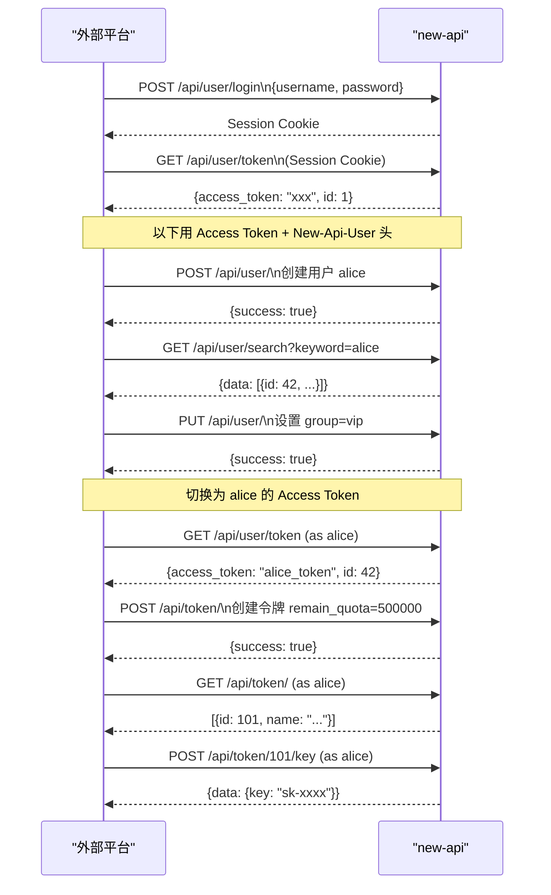

以下是从外部平台调用这四个操作的完整指南。

---

## 认证方式（外部平台必读）

管理 API 使用 **Access Token + 用户 ID 双头认证**，不依赖 Session Cookie，适合服务端调用。 [1](#1-0) 

每个请求需携带两个 Header：

```
Authorization: Bearer {access_token}
New-Api-User: {user_id}
```

**获取 Access Token 的步骤：**
1. `POST /api/user/login` 登录（获取 Session）
2. `GET /api/user/token` 生成/获取 Access Token（需 Session 或已有 Access Token）

---

## 操作一：创建用户

**权限：** 管理员（Admin）

```
POST /api/user/
Authorization: Bearer {admin_access_token}
New-Api-User: {admin_user_id}
Content-Type: application/json
```

**请求体：**
```json
{
  "username": "alice",
  "password": "password123",
  "display_name": "Alice",
  "role": 1,
  "remark": "来自外部平台创建"
}
```

| 字段 | 类型 | 必填 | 说明 |
|------|------|------|------|
| `username` | string | 是 | 用户名，最长 20 字符，唯一 |
| `password` | string | 是 | 密码，8~20 字符 |
| `display_name` | string | 否 | 显示名，为空则用 username |
| `role` | int | 否 | `1`=普通用户，`10`=管理员（不能 >= 自己的角色） |
| `remark` | string | 否 | 备注，仅管理员可见，最长 255 字符 |

**响应：**
```json
{"success": true, "message": ""}
```

> **注意：** 响应不返回新用户 ID，需用下面的搜索接口获取：
> ```
> GET /api/user/search?keyword=alice
> Authorization: Bearer {admin_access_token}
> New-Api-User: {admin_user_id}
> ``` [2](#1-1) 

---

## 操作二：给用户分组

**权限：** 管理员（Admin）

`group` 字段在 `User` 模型中，通过 `PUT /api/user/` 更新。

```
PUT /api/user/
Authorization: Bearer {admin_access_token}
New-Api-User: {admin_user_id}
Content-Type: application/json
```

**请求体（必须包含 `id` 和 `username`）：**
```json
{
  "id": 42,
  "username": "alice",
  "display_name": "Alice",
  "group": "vip",
  "quota": 0
}
```

| 字段 | 类型 | 必填 | 说明 |
|------|------|------|------|
| `id` | int | 是 | 用户 ID |
| `username` | string | 是 | 用户名（不可修改，但必须传） |
| `group` | string | 是 | 分组名，如 `default`、`vip`、`enterprise` |

**查询可用分组：**
```
GET /api/group/
Authorization: Bearer {admin_access_token}
New-Api-User: {admin_user_id}
``` [3](#1-2) [4](#1-3) 

---

## 操作三：给用户创建令牌

**权限：** 普通用户（UserAuth）—— **令牌归属于当前认证用户**

`/api/token/` 路由是用户自身作用域，`AddToken` 内部用 `c.GetInt("id")` 绑定 owner。因此**需要以目标用户身份认证**。 [5](#1-4) 

**流程：**
1. 以目标用户身份登录，获取其 Access Token（`GET /api/user/token`）
2. 用该 Access Token 创建令牌：

```
POST /api/token/
Authorization: Bearer {target_user_access_token}
New-Api-User: {target_user_id}
Content-Type: application/json
```

**请求体：**
```json
{
  "name": "外部平台令牌",
  "remain_quota": 500000,
  "unlimited_quota": false,
  "expired_time": -1,
  "model_limits_enabled": false,
  "model_limits": "",
  "group": "vip"
}
```

| 字段 | 类型 | 说明 |
|------|------|------|
| `name` | string | 令牌名称，最长 50 字符 |
| `remain_quota` | int | 初始额度（单位：内部 quota 单位） |
| `unlimited_quota` | bool | `true` 则不限额度 |
| `expired_time` | int64 | Unix 时间戳，`-1` 表示永不过期 |
| `model_limits_enabled` | bool | 是否启用模型白名单 |
| `model_limits` | string | 逗号分隔的模型名，如 `"gpt-4o,claude-3-5-sonnet"` |
| `group` | string | 令牌使用的渠道分组 |
| `allow_ips` | string | IP 白名单，换行分隔 |
| `cross_group_retry` | bool | 跨分组重试（仅 auto 分组有效） |

**创建成功后获取令牌 Key：**
```
POST /api/token/{token_id}/key
Authorization: Bearer {target_user_access_token}
New-Api-User: {target_user_id}
```

响应：
```json
{"success": true, "message": "", "data": {"key": "sk-xxxxxxxxxxxxxxxx"}}
``` [6](#1-5) 

---

## 操作四：给令牌设置额度

**方式 A：更新令牌（UserAuth，以令牌所属用户身份）**

```
PUT /api/token/
Authorization: Bearer {target_user_access_token}
New-Api-User: {target_user_id}
Content-Type: application/json
```

**请求体（必须包含 `id`）：**
```json
{
  "id": 101,
  "name": "外部平台令牌",
  "remain_quota": 1000000,
  "unlimited_quota": false,
  "expired_time": -1,
  "model_limits_enabled": false,
  "model_limits": "",
  "group": "vip"
}
``` [7](#1-6) 

**方式 B：通过 ManageUser 调整用户总额度（AdminAuth，无需用户身份）**

如果只需控制用户整体可用额度（不细分到令牌），可直接操作用户配额：

```
POST /api/user/manage
Authorization: Bearer {admin_access_token}
New-Api-User: {admin_user_id}
Content-Type: application/json
```

```json
{
  "id": 42,
  "action": "add_quota",
  "value": 500000,
  "mode": "override"
}
```

| `mode` | 说明 |
|--------|------|
| `add` | 在现有基础上增加 |
| `subtract` | 在现有基础上减少 |
| `override` | 直接覆盖为指定值 | [8](#1-7) 

---

## 完整调用流程示例



---

## 关键注意事项

1. **额度单位**：`quota` 的内部单位不是美元，换算关系由系统配置的 `QuotaPerUnit` 决定（通常 `500000 quota = $1`）。可通过 `GET /api/pricing` 查看模型定价来推算。

2. **令牌创建必须以目标用户身份**：`/api/token/` 没有管理员代理创建接口，必须用目标用户的 Access Token。

3. **Access Token 生成**：`GET /api/user/token` 每次调用会重新生成并覆盖旧 token，注意幂等性。

4. **分组必须存在**：`group` 字段的值必须是系统中已配置的渠道分组，否则请求会路由失败。可通过 `GET /api/group/` 查询可用分组。

### Citations

**File:** middleware/auth.go (L37-95)
```go
func authHelper(c *gin.Context, minRole int) {
	session := sessions.Default(c)
	username := session.Get("username")
	role := session.Get("role")
	id := session.Get("id")
	status := session.Get("status")
	useAccessToken := false
	if username == nil {
		// Check access token
		accessToken := c.Request.Header.Get("Authorization")
		if accessToken == "" {
			c.JSON(http.StatusUnauthorized, gin.H{
				"success": false,
				"message": common.TranslateMessage(c, i18n.MsgAuthNotLoggedIn),
			})
			c.Abort()
			return
		}
		user, authErr := model.ValidateAccessToken(accessToken)
		if authErr != nil {
			if errors.Is(authErr, model.ErrDatabase) {
				common.SysLog("ValidateAccessToken database error: " + authErr.Error())
				c.JSON(http.StatusInternalServerError, gin.H{
					"success": false,
					"message": common.TranslateMessage(c, i18n.MsgDatabaseError),
				})
			} else {
				c.JSON(http.StatusOK, gin.H{
					"success": false,
					"message": common.TranslateMessage(c, i18n.MsgAuthAccessTokenInvalid),
				})
			}
			c.Abort()
			return
		}
		if user != nil && user.Username != "" {
			if !validUserInfo(user.Username, user.Role) {
				c.JSON(http.StatusOK, gin.H{
					"success": false,
					"message": common.TranslateMessage(c, i18n.MsgAuthUserInfoInvalid),
				})
				c.Abort()
				return
			}
			// Token is valid
			username = user.Username
			role = user.Role
			id = user.Id
			status = user.Status
			useAccessToken = true
		} else {
			c.JSON(http.StatusOK, gin.H{
				"success": false,
				"message": common.TranslateMessage(c, i18n.MsgAuthAccessTokenInvalid),
			})
			c.Abort()
			return
		}
	}
```

**File:** controller/user.go (L632-699)
```go
func UpdateUser(c *gin.Context) {
	var updatedUser model.User
	err := json.NewDecoder(c.Request.Body).Decode(&updatedUser)
	if err != nil || updatedUser.Id == 0 {
		common.ApiErrorI18n(c, i18n.MsgInvalidParams)
		return
	}
	updatedUser.Username = strings.TrimSpace(updatedUser.Username)
	if updatedUser.Username == "" {
		common.ApiErrorI18n(c, i18n.MsgInvalidParams)
		return
	}
	if updatedUser.Password == "" {
		updatedUser.Password = "$I_LOVE_U" // make Validator happy :)
	}
	if err := common.Validate.Struct(&updatedUser); err != nil {
		common.ApiErrorI18n(c, i18n.MsgUserInputInvalid, map[string]any{"Error": err.Error()})
		return
	}
	originUser, err := model.GetUserById(updatedUser.Id, false)
	if err != nil {
		common.ApiError(c, err)
		return
	}
	if updatedUser.Role != common.RoleGuestUser && updatedUser.Role != originUser.Role {
		common.ApiErrorI18n(c, i18n.MsgInvalidParams)
		return
	}
	updatedUser.Role = originUser.Role
	myRole := c.GetInt("role")
	if !canManageTargetRole(myRole, originUser.Role) {
		common.ApiErrorI18n(c, i18n.MsgUserNoPermissionHigherLevel)
		return
	}
	if updatedUser.Password == "$I_LOVE_U" {
		updatedUser.Password = "" // rollback to what it should be
	}
	updatePassword := updatedUser.Password != ""
	authzTouched := false
	if err := model.DB.Transaction(func(tx *gorm.DB) error {
		if err := updatedUser.EditWithTx(tx, updatePassword); err != nil {
			return err
		}
		touched, err := updateAdminPermissionsForUserInTx(c, tx, updatedUser.Id, originUser.Role, updatedUser.AdminPermissions)
		authzTouched = touched
		return err
	}); err != nil {
		common.ApiError(c, err)
		return
	}
	if authzTouched {
		if err := authz.ReloadPolicy(); err != nil {
			common.ApiError(c, err)
			return
		}
	}
	if err := model.InvalidateUserCache(updatedUser.Id); err != nil {
		common.SysLog(fmt.Sprintf("failed to invalidate user cache for user %d: %s", updatedUser.Id, err.Error()))
	}
	recordManageAuditFor(c, updatedUser.Id, "user.update", map[string]interface{}{
		"username": originUser.Username,
		"id":       updatedUser.Id,
	})
	c.JSON(http.StatusOK, gin.H{
		"success": true,
		"message": "",
	})
	return
```

**File:** controller/user.go (L922-978)
```go
func CreateUser(c *gin.Context) {
	var user model.User
	err := json.NewDecoder(c.Request.Body).Decode(&user)
	user.Username = strings.TrimSpace(user.Username)
	if err != nil || user.Username == "" || user.Password == "" {
		common.ApiErrorI18n(c, i18n.MsgInvalidParams)
		return
	}
	if err := common.Validate.Struct(&user); err != nil {
		common.ApiErrorI18n(c, i18n.MsgUserInputInvalid, map[string]any{"Error": err.Error()})
		return
	}
	if user.DisplayName == "" {
		user.DisplayName = user.Username
	}
	myRole := c.GetInt("role")
	if user.Role >= myRole {
		common.ApiErrorI18n(c, i18n.MsgUserCannotCreateHigherLevel)
		return
	}
	// Even for admin users, we cannot fully trust them!
	cleanUser := model.User{
		Username:    user.Username,
		Password:    user.Password,
		DisplayName: user.DisplayName,
		Role:        user.Role, // 保持管理员设置的角色
	}
	authzTouched := false
	if err := model.DB.Transaction(func(tx *gorm.DB) error {
		if err := cleanUser.InsertWithTx(tx, 0); err != nil {
			return err
		}
		touched, err := updateAdminPermissionsForUserInTx(c, tx, cleanUser.Id, cleanUser.Role, user.AdminPermissions)
		authzTouched = touched
		return err
	}); err != nil {
		common.ApiError(c, err)
		return
	}
	if authzTouched {
		if err := authz.ReloadPolicy(); err != nil {
			common.ApiError(c, err)
			return
		}
	}
	cleanUser.FinishInsert(0)

	recordManageAuditFor(c, cleanUser.Id, "user.create", map[string]interface{}{
		"username": cleanUser.Username,
		"role":     cleanUser.Role,
	})
	c.JSON(http.StatusOK, gin.H{
		"success": true,
		"message": "",
	})
	return
}
```

**File:** controller/user.go (L1072-1116)
```go
	case "add_quota":
		switch req.Mode {
		case "add":
			if req.Value <= 0 {
				common.ApiErrorI18n(c, i18n.MsgUserQuotaChangeZero)
				return
			}
			if err := model.IncreaseUserQuota(user.Id, req.Value, true); err != nil {
				common.ApiError(c, err)
				return
			}
			recordManageAuditFor(c, user.Id, "user.quota_add", map[string]interface{}{
				"quota": logger.LogQuota(req.Value),
			})
		case "subtract":
			if req.Value <= 0 {
				common.ApiErrorI18n(c, i18n.MsgUserQuotaChangeZero)
				return
			}
			if err := model.DecreaseUserQuota(user.Id, req.Value, true); err != nil {
				common.ApiError(c, err)
				return
			}
			recordManageAuditFor(c, user.Id, "user.quota_subtract", map[string]interface{}{
				"quota": logger.LogQuota(req.Value),
			})
		case "override":
			oldQuota := user.Quota
			if err := model.DB.Model(&model.User{}).Where("id = ?", user.Id).Update("quota", req.Value).Error; err != nil {
				common.ApiError(c, err)
				return
			}
			recordManageAuditFor(c, user.Id, "user.quota_override", map[string]interface{}{
				"from": logger.LogQuota(oldQuota),
				"to":   logger.LogQuota(req.Value),
			})
		default:
			common.ApiErrorI18n(c, i18n.MsgInvalidParams)
			return
		}
		c.JSON(http.StatusOK, gin.H{
			"success": true,
			"message": "",
		})
		return
```

**File:** model/user.go (L23-56)
```go
type User struct {
	Id               int                        `json:"id"`
	Username         string                     `json:"username" gorm:"unique;index" validate:"max=20"`
	Password         string                     `json:"password" gorm:"not null;" validate:"min=8,max=20"`
	OriginalPassword string                     `json:"original_password" gorm:"-:all"` // this field is only for Password change verification, don't save it to database!
	DisplayName      string                     `json:"display_name" gorm:"index" validate:"max=20"`
	Role             int                        `json:"role" gorm:"type:int;default:1"`   // admin, common
	Status           int                        `json:"status" gorm:"type:int;default:1"` // enabled, disabled
	Email            string                     `json:"email" gorm:"index" validate:"max=50"`
	GitHubId         string                     `json:"github_id" gorm:"column:github_id;index"`
	DiscordId        string                     `json:"discord_id" gorm:"column:discord_id;index"`
	OidcId           string                     `json:"oidc_id" gorm:"column:oidc_id;index"`
	WeChatId         string                     `json:"wechat_id" gorm:"column:wechat_id;index"`
	TelegramId       string                     `json:"telegram_id" gorm:"column:telegram_id;index"`
	VerificationCode string                     `json:"verification_code" gorm:"-:all"`                         // this field is only for Email verification, don't save it to database!
	AccessToken      *string                    `json:"-" gorm:"type:char(32);column:access_token;uniqueIndex"` // this token is for system management
	Quota            int                        `json:"quota" gorm:"type:int;default:0"`
	UsedQuota        int                        `json:"used_quota" gorm:"type:int;default:0;column:used_quota"` // used quota
	RequestCount     int                        `json:"request_count" gorm:"type:int;default:0;"`               // request number
	Group            string                     `json:"group" gorm:"type:varchar(64);default:'default'"`
	AffCode          string                     `json:"aff_code" gorm:"type:varchar(32);column:aff_code;uniqueIndex"`
	AffCount         int                        `json:"aff_count" gorm:"type:int;default:0;column:aff_count"`
	AffQuota         int                        `json:"aff_quota" gorm:"type:int;default:0;column:aff_quota"`           // 邀请剩余额度
	AffHistoryQuota  int                        `json:"aff_history_quota" gorm:"type:int;default:0;column:aff_history"` // 邀请历史额度
	InviterId        int                        `json:"inviter_id" gorm:"type:int;column:inviter_id;index"`
	DeletedAt        gorm.DeletedAt             `gorm:"index"`
	LinuxDOId        string                     `json:"linux_do_id" gorm:"column:linux_do_id;index"`
	Setting          string                     `json:"setting" gorm:"type:text;column:setting"`
	Remark           string                     `json:"remark,omitempty" gorm:"type:varchar(255)" validate:"max=255"`
	StripeCustomer   string                     `json:"stripe_customer" gorm:"type:varchar(64);column:stripe_customer;index"`
	CreatedAt        int64                      `json:"created_at" gorm:"autoCreateTime;column:created_at"`
	LastLoginAt      int64                      `json:"last_login_at" gorm:"default:0;column:last_login_at"`
	AdminPermissions map[string]map[string]bool `json:"admin_permissions,omitempty" gorm:"-:all"`
}
```

**File:** controller/token.go (L167-234)
```go
func AddToken(c *gin.Context) {
	token := model.Token{}
	err := c.ShouldBindJSON(&token)
	if err != nil {
		common.ApiError(c, err)
		return
	}
	if len(token.Name) > 50 {
		common.ApiErrorI18n(c, i18n.MsgTokenNameTooLong)
		return
	}
	// 非无限额度时，检查额度值是否超出有效范围
	if !token.UnlimitedQuota {
		if token.RemainQuota < 0 {
			common.ApiErrorI18n(c, i18n.MsgTokenQuotaNegative)
			return
		}
		maxQuotaValue := int((1000000000 * common.QuotaPerUnit))
		if token.RemainQuota > maxQuotaValue {
			common.ApiErrorI18n(c, i18n.MsgTokenQuotaExceedMax, map[string]any{"Max": maxQuotaValue})
			return
		}
	}
	// 检查用户令牌数量是否已达上限
	maxTokens := operation_setting.GetMaxUserTokens()
	count, err := model.CountUserTokens(c.GetInt("id"))
	if err != nil {
		common.ApiError(c, err)
		return
	}
	if int(count) >= maxTokens {
		c.JSON(http.StatusOK, gin.H{
			"success": false,
			"message": fmt.Sprintf("已达到最大令牌数量限制 (%d)", maxTokens),
		})
		return
	}
	key, err := common.GenerateKey()
	if err != nil {
		common.ApiErrorI18n(c, i18n.MsgTokenGenerateFailed)
		common.SysLog("failed to generate token key: " + err.Error())
		return
	}
	cleanToken := model.Token{
		UserId:             c.GetInt("id"),
		Name:               token.Name,
		Key:                key,
		CreatedTime:        common.GetTimestamp(),
		AccessedTime:       common.GetTimestamp(),
		ExpiredTime:        token.ExpiredTime,
		RemainQuota:        token.RemainQuota,
		UnlimitedQuota:     token.UnlimitedQuota,
		ModelLimitsEnabled: token.ModelLimitsEnabled,
		ModelLimits:        token.ModelLimits,
		AllowIps:           token.AllowIps,
		Group:              token.Group,
		CrossGroupRetry:    token.CrossGroupRetry,
	}
	err = cleanToken.Insert()
	if err != nil {
		common.ApiError(c, err)
		return
	}
	c.JSON(http.StatusOK, gin.H{
		"success": true,
		"message": "",
	})
}
```

**File:** controller/token.go (L250-313)
```go
func UpdateToken(c *gin.Context) {
	userId := c.GetInt("id")
	statusOnly := c.Query("status_only")
	token := model.Token{}
	err := c.ShouldBindJSON(&token)
	if err != nil {
		common.ApiError(c, err)
		return
	}
	if len(token.Name) > 50 {
		common.ApiErrorI18n(c, i18n.MsgTokenNameTooLong)
		return
	}
	if !token.UnlimitedQuota {
		if token.RemainQuota < 0 {
			common.ApiErrorI18n(c, i18n.MsgTokenQuotaNegative)
			return
		}
		maxQuotaValue := int((1000000000 * common.QuotaPerUnit))
		if token.RemainQuota > maxQuotaValue {
			common.ApiErrorI18n(c, i18n.MsgTokenQuotaExceedMax, map[string]any{"Max": maxQuotaValue})
			return
		}
	}
	cleanToken, err := model.GetTokenByIds(token.Id, userId)
	if err != nil {
		common.ApiError(c, err)
		return
	}
	if token.Status == common.TokenStatusEnabled {
		if cleanToken.Status == common.TokenStatusExpired && cleanToken.ExpiredTime <= common.GetTimestamp() && cleanToken.ExpiredTime != -1 {
			common.ApiErrorI18n(c, i18n.MsgTokenExpiredCannotEnable)
			return
		}
		if cleanToken.Status == common.TokenStatusExhausted && cleanToken.RemainQuota <= 0 && !cleanToken.UnlimitedQuota {
			common.ApiErrorI18n(c, i18n.MsgTokenExhaustedCannotEable)
			return
		}
	}
	if statusOnly != "" {
		cleanToken.Status = token.Status
	} else {
		// If you add more fields, please also update token.Update()
		cleanToken.Name = token.Name
		cleanToken.ExpiredTime = token.ExpiredTime
		cleanToken.RemainQuota = token.RemainQuota
		cleanToken.UnlimitedQuota = token.UnlimitedQuota
		cleanToken.ModelLimitsEnabled = token.ModelLimitsEnabled
		cleanToken.ModelLimits = token.ModelLimits
		cleanToken.AllowIps = token.AllowIps
		cleanToken.Group = token.Group
		cleanToken.CrossGroupRetry = token.CrossGroupRetry
	}
	err = cleanToken.Update()
	if err != nil {
		common.ApiError(c, err)
		return
	}
	c.JSON(http.StatusOK, gin.H{
		"success": true,
		"message": "",
		"data":    buildMaskedTokenResponse(cleanToken),
	})
}
```

**File:** model/token.go (L14-32)
```go
type Token struct {
	Id                 int            `json:"id"`
	UserId             int            `json:"user_id" gorm:"index"`
	Key                string         `json:"key" gorm:"type:varchar(128);uniqueIndex"`
	Status             int            `json:"status" gorm:"default:1"`
	Name               string         `json:"name" gorm:"index" `
	CreatedTime        int64          `json:"created_time" gorm:"bigint"`
	AccessedTime       int64          `json:"accessed_time" gorm:"bigint"`
	ExpiredTime        int64          `json:"expired_time" gorm:"bigint;default:-1"` // -1 means never expired
	RemainQuota        int            `json:"remain_quota" gorm:"default:0"`
	UnlimitedQuota     bool           `json:"unlimited_quota"`
	ModelLimitsEnabled bool           `json:"model_limits_enabled"`
	ModelLimits        string         `json:"model_limits" gorm:"type:text"`
	AllowIps           *string        `json:"allow_ips" gorm:"default:''"`
	UsedQuota          int            `json:"used_quota" gorm:"default:0"` // used quota
	Group              string         `json:"group" gorm:"default:''"`
	CrossGroupRetry    bool           `json:"cross_group_retry"` // 跨分组重试，仅auto分组有效
	DeletedAt          gorm.DeletedAt `gorm:"index"`
}
```
